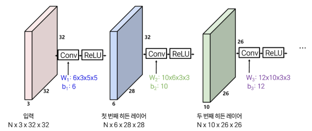
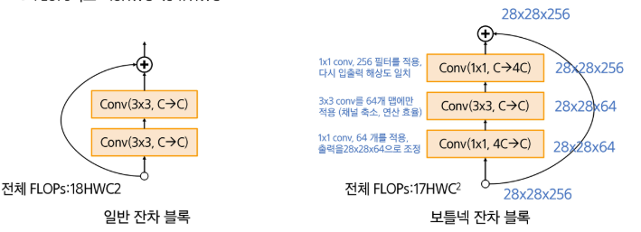
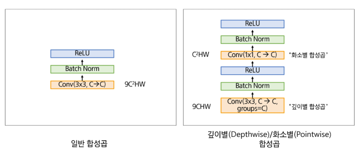

# 8월 14일 금
# CNN
합성곱 레이어
- 입력 이미지를 필터와 연산하여 특징 맵을 뽑아내는 모듈
- 1차원 구조로 변호나하는 FCN과 달리 3차원 구조를 그대로 보존하면서 연산
- 컨볼루션 : 필터를 이미지 상에서 이동시키면서 내적을 반복 수행, 내적으로 구한 모든 값을 출력 제공

## 1-2. CNN 모델 구조 - 중첩

## 1-2. CNN 모델 구조 - 수용영역
중첩과 수용영역
- CNN 레이어는 이미지 작은 부분인 "지역 정보"를 추출하는데 유리하게 설계
- 이미지 활용하는 다양한 직업에서 이미지 전체 의미파악이 필요
  - 따라서 "지역 정보 + 이미지 전체의 맥락"을 이해/활용하기 위한 설계가 필요함

- 수용영역이란?
  - CNN이 이미지를 처리하면서 한 번에 볼 수 있는 영역의 크기
  - 네트워크의 시야
  - 일반적으로 네트워크가 깊어질 수록 수용영역도 넓어짐 -> 폭 넓은 맥락 이해 가능

- 고해상도 이미지 처리시, 많은 레이어를 통과해야 함.
  - 연산, 비용, 학습 가능성 고려할 때 비실용적
- 실제 해법 : 입력 사이즈를 줄여 모델에 입력함
  
풀링 : 효율적 연산 및 위치 변화의 강건성 확보
- CNN 레이어의 출력을 줄여 연산 효율성을 확보 : 입력 크기가 줄면 CNN의 연산량이 크게 줄어듦.
- 위치 변화 강건성 : 입력 내 객체 위치가 다소 변해도 동일한 출력을 제공
- 사실상 저해상도 정보에 근거하여 작업 수행하므로 몇 화소 이동은 무시됨.
- 맥스풀링 : 정해진 커널 사이즈(ex: 2x2)로 이미지를 나누어 각 영역 내 가장 큰 값을 선택하는 연산
  

스트라이드 합성곱 : 풀링 한계 개선
- 일반 합성곱 : 필터를 1칸씩 이동하면서 연산 수행(출력값 계산)
- 스트라이드 합성곱 : 필터를 스트라이드 값만큼 (S칸) 이동한 후 출력 연산
- 효과 : 풀링 처럼 입력 해상도를 줄임 (연산 효율과 위치 강건성)

## 2-1. AlexNet
5 개의 합성곱 계층과 3개의 완전연결 계층으로 구성된 8계층 CNN 모델
- 모델 구조 특징
  - 5개 합성곱 레이어
  - 맥스 풀링
  - 3개 연결층 레이어
  - ReLU 비선형 활성화
  * 8-레이어

- 입출력
  - 입력 : 이미지 / 3x277x277 해상도
  - 출력 : 레이블 / 1x1024
  - 학습 시 정답은 원-핫 벡터
  - 예측값은 각 클래스에 대한 0~1 사이의 확률
  - (imageNet 기준, 각 클래스에 해당할 확률)

Image inpu 224, 2*GPU
- 논문 그림에는 입력 크기가 224로 되어있으나, 227로 정정 되었음
- 당시 사용된 GPU는 GTX 580으로 메모리가 3GB 밖에 되지 않아 2개의 GPU를 병렬 사용
- Conv/FC 레이어를 GPU 2개에 분산 = 채널/뉴런 반씩 나눠 계산

## 2-2. VGGNet
5개의 합성곱 블록 + 맥스 풀링 구조
  
VGG-16 기준
- 모델 구조 특징
  - 5개 합성곱 블록 (각 블록당 합성곱 - ReLU 구조가 반복)
  - 각 블록당 맥스 풀링
  - 3개 연결층 레이어
  - ReLU 비선형 활성화
  - 총 16개의 합성곱/연결층 레이어
  - 최종 소프트맥스 수행

- 입출력
  - 입력 이미지 / 3x224x224 해상도
  - 출력 : 레이블 / 1x1024

VGG의 레슨
- 작고 단순한 필터를 깊게 쌓으면 성능이 높아진다
  - 새로운 설계 철학 제시

VGG의 디자인 룰
- 3x3 합성곱/스트라이드1/패딩1 반복 적용
- 맥스풀링(2x2)으로 크기 줄이기
- 풀링 후, 채널 크기 2배 적용
  - 3x3 합성곱 두 개를 연달아 적용하면 -> 보는 영역이 넓어짐
  - 5x5 합성곱과 동일 리셉티브 필드 확보  
  -> 그럼에도 연산량을 크게 줄일 수 있음
  
모델 특징
- 단순함 + 깊이의 강력한 성능을 보임
- 단순 설계로 모델 해석에 이상적
- 특징 추출기, 전이학습에 강력한 베이스라인
  - 파라미터가 많고 연산량 요구가 매우 큼

## 2-3. ResNet
합성곱 블록(VGG유사)과 잔차(Residual) 블록
  
모델 구조 특징 (ResNet-50 기준)
- 합성곱 블록(VGG유사)과 잔차(Residual) 블록
- 잔차 블록은 블록입력을 그대로 출력에 더해주는 지름길 연결이 특징
- Inception 모델에서 차원 축소로 활용된 1x1 합성곱을 적용, 연산 효율 개선
- 입출력
  - 입력 : 이미지 / 3x224x224 해상도
  - 출력 : 레이블 / 1x1024

ResNet의 등장 배경
- 배치 정규화 방식으로 10+ 레이어 학습 가능
  - 20-layer 모델 : 학습이 안정적으로 진행되며 에러가 꾸준히 감소
  - 56-layer 모델 : 더 깊음에도 불구하고 training error가 오히려 높음
- 깊다고 무조건 학습이 잘 되는 것은 아님
* 트레이닝도 테스트도 잘 안 됨

ResNet의 아이디어
- 배치 정규화 방식으로 10+ 레이어 학습 가능
- 작은 모델(10+레이어)의 성능은 "최소한" 누릴 수 있도록
  - 작은 레이어의 추정값(입력값)을 그대로 후속 레이어에 제공하여 최소한 작은 레이어 수준으 성능은 보장  
  -> Residual Block(잔차 블록)의 핵심 아이디어
  
Residual Block
- 입력 X가 두 경로로 나뉘어 전달됨
  1. 변환 경로
  2. Shortcut 경로
- 마지막에 두 값을 더함 : Output = F(x) + x
- 만약, 학습이 잘 안된다면 F(x) = 0 이 될 수 있고 출력은 x가 됨 -> 최소 성능 보장
* Res Block 은 입력과 출력의 사이즈를 맞춰주는 것이 중요하다.

  
Stem 구조
- 기존 모델의 효율성 레시피를 잘 활용
  1. 스템 구조를 모델 초기에 도입, 입구 데이터 해상도를 1/4로 줄이고 이후 잔차 블록 적용
  2. 여러 개의 FC 레이어를 제고하고 (GoogleLeNet에서 제안)  
    전역 평균 풀링르 사용 -> 마지막 1개 FC만 적용

잘 알려진 ResNet 학습 레시피
- 모든 Conv 레이어 적용 시 배치정규화 수행
- Xavier 초기화 (He 초기화) 적용/그레디언트 소실 문제 다룸 (Xavier, He 초기 가중치 초기화 방법론)
- SGD + 모멘텀 (0.9) 사용
- 학습 비율 0.1 적용, 단 Val 오류가 정체되면 1/10로 비율 축소
- 미니 배치 사이즈는 256 사용
- 웨이트 디케이 1e-5
- 드롭 아웃 미사용

## 2-4. MobileNet
목표 : 모바일/임베디드 환경에서 구동 가능
- 기존 합성곱은 공간(HxW)와 채널(C)를 동시 처리하여 연산량이 과도하게 요구됨
- MobileNet의 핵심 아이디어 : 공간과 채널을 두 단계로 분리하여 처리
  - 깊이별 합성곱 : 각 채널별 독립적 3x3 합성곱 수행
  - 화소별 합성곱 : 1x1 합성곱을 채널 방향으로 적용
- 효과
  - 연산량 기존 대비 9배 가량 절감
  - 모달 상수 대폭 감소

깊이별 합성곱/화소별 합성곱 예시

  
이후 모델에 영향력
- 가볍고 빠른 모델로 엣지 디바이스에서 딥러닝 모델 실시간 실행 가능함을 보임
- 효율형 모델 구조의 표준 제시 : 깊이별 합성곱과 보틀넥 구조가 이후 경량 모델에서 지속적으로 채택

# 오후 수업
## 1-1. CNN 구조의 장점
합성곱 구조의 특성
- 지역적인 특징 학습에 특화 : 작은 필터로 학습하여 패턴 / 경계선 특징 포착 용이
- 파라미터 효율성 우수 : 지역적 특징 추출 시 이미지 블록별 가중치를 공유하여 연산량 절감
- 위치 변화와 노이즈에 견고 : pooling/Stride 합성곱이 세부 차이는 줄이고 이미지 전체 의미에 집중
- 이미지 분류/탐지 등 이미지 기반의 과업에서 표준 모델로 활약

## 1-2. CNN의 핵심 한계
CNN은 데이터 순서(order)를 무시
- 한계 : 순차적 데이터의 순서 정보를 반영하기 어려움
  
긴 거리 의존성 고려 부족
- 한계 : CNN은 국소적(로컬) 특징 추출에 강하지만, 이미지나 문장에서 멀리 떨어진 요소 간의 관계를 잘 학습하지 못 함.

픽셀 단위 복원으 ㅣ한계
- 한계 : CNN은 이미지 전체의 정보를 압축에 효과적이지만 위치 정보는 손실됨

# 2. 시퀀스 데이터 처리 RNN
## 2-1. RNN
순차적 데이터를 처리하기 위해 고안된 신경망 구조
- 순차적 정보 반영 : 이전 단계 데이터를 은닉 상태로 다음 단계에 전달
  -> 시간/순서으 흐름을 반영할 수 있다.
- 시계열/언어 데이터 적합 : 문장, 음성신호, 센서 데이터 등 시계열 데이터 처리에 관한 강력한 귀납 편향 제공

RNN 셀
- 은닉츠에서 활성화 함수를 통해 결과를 내보내는 역할
  - x : 입력층의 입력 벡터
  - y : 출력층의 출력 벡터
- 은닉 상태 : 메모리 셀이 출력층 방향 또는 다음 시점이 t+1의 자신에게 보내는 값

시계열 의존성
- h_t가 이전 상태 h_t-1에 의존.
- 데이터의 시계열 특징을 반영하는 모델이나, RNN 상수는 시계열에 무관, 동일 학습

순수 RNN
- 선형변환, 바이어스를 모델상수/비선형 (tanh) 함수 추가로 구성된 단순한 형태
- 은닉 상태 계산
- 출력 계산
  - 은닉 상태를 기반으로 최종 출력 생성

RNN 입출력 구조
- one-ty-many : 하나의 입력에서 시간축으로 출력이 생성
- many-to-one : 여러 시점 입력이 하나의 출력으로 압축
- many-to-many : 입력과 출력이 시간축을 따라 1:1 혹은 n:m 으로 맵핑

## 2-2. 단순 RNN의 한계
기울기 폭발 혹은 소실 발생
- 역전파의 시퀀스 데이터가 적용되면서 선형가중치 W가 기울기 계산 시, 계속 곱셈으로 반영됨
- 이상적으로 w의 특이값 1 이면 온전한 학습 가능

## 2-3. 대안 모델
LSTM
- LSTM : 셀 상태, 게이트 유닛으로 구성
  - 셀 상태 : 중요한 정보를 유지/기억하는 역할
  - 게이트 : 정보의 흐르름을 제어
  - 구동철학 : 긴 시쿼스 데이터에서 팔요한 정보는 유지, 불필요한 정보는 지워 안정적 학습 유도

  - 입력 게이트 (i) : 새로운 정보의 저장
  - 망각 게이트 (g) : 과거 정보를 제거
  - 출력 게이트(o) : 셀 상태를 현재 은닉 상태로 출력

- 셀 상태 라는 새로운 모듈을 도입
- 기울기 전파 시 선형가중치의 곱 이외에 덧셈 형태로 전달하여 기울기를 장기적으로 보존 가능

# 3. 긴거리 의존성 : 어텐션 / ViT
## 3-1. 어텐션 매커니즘
이미지를 통해 어텐션 메커니즘 이해하기
- 픽셀 거리와 상관없이 유사한 패치가 이미지에 존재
  - 패치(Patch): 이미지를 일정 크기로 잘라낸 작은 조각 단위

- 관련 높은 패치/관련 낮은 패치 정보를 최종 결정에 반영하자!
  - 쿼리(Q) : 집중하려는 대상
  - 키(K) : 다른 패치
  - 값(V) : 키 패치의 정보
  - 어텐션(a) : 쿼리와 키의 유사도 (확률 분포 형태)
  - 출력(o) : 어텐션으로 가감된 값의 총합

## 3-1. 셀프 어텐션이란?
- 하나의 입력 안에서 패치 정보(쿼리/키/값)을 정의
- 같은 이미지 내 유사도(쿼리와 키 간 유사도) 반영
- 입력 내부 패치간 연결망 구축 -> 클러스터링 효과
  - 비슷한 역할, 특징을 가진 패치들이 자연스럽게 하나의 그룹처럼 묶임

## 3-1. 교차 어텐션
- 둘 이상으 이종 데이터에서 패치 정보(쿼리/키/값)을 정의
- 이종 데이터 간 유사도 (쿼리와 키 간 유사도)반영
- 서로 다른 입력간 연결망 구축

## 3-2. 모델별 특성 정리
- CNN : 지역적 특성에 집중, 장거리 맥락 이해 떨어짐, 데이터 순서 반영불가
- RNN : 데이터 순서를 반영, 장거리 맥락 학습이 어려움 (기울기 소실/폭발)
- LSTM : 데이터 순서 반영, 장거리 맥락 이해 가능, 정보 희석 문제
- Attention : 장거리 맥락에 탁월, 정보 희석 없음, 데이터 순서

## 3-2. ViT 위치 인코딩
패치 순서(위치) 정보 제공
- 각 입력 토큰에 위치 정보를 담은 벡터를 추가

학습 가능한 위치 인코딩
- 데이터에 알맞게 최적화
  - (+) 데이터 해상도가 바뀌어도 동일한 룰 적용
  - (-) 해상도가 바뀌면 다시 학습 필요

사인파 인코딩
- 데이터에 알맞게 최적화
  - (+) 데이터 해상도가 바뀌어도 동일한 룰 적용
  - (-) 고정이라 데이터/과업에 특화된 방식이 아님

상대 위치 인코딩
- 절대 위치가 아닌, 상대적 위치를 인코딩
  - (+) 해상도 변화에도 적용 가능
  - (-) 절대적 위치 고려가 어려움

회전 포지션 임베딩 (2D RoPE)
- 위치 벡터를 더하지 않고 Q/K에 회전행렬 적용
  - (+) 상대 위치 표현 (해상도 가변)
  - (-) 연산량 추가(Q/K 당 매번 회전연상), 절대 위치 소실

## 3-2. ViT 인코더
인코더 내부 구조
- 정규화 - 다중헤드 어텐션 - 정규화 - 연결층으로 구성
  - 정규화 : 입력을 균일하게 맞춤
  - 다중헤드 어텐션 : 여러 관점에서 패치 간 관계를 학습
  - 연결층 : 어텐션 정보를 조합, 변환해 더 풍부한 특징 생성
- 인코더 L개 통과 (일반적으로 12개 이상)

전역 관계 학습
- CNN: 지역적 영역에서 수용영역을 넓혀 전역 이해
- ViT: 수용영역을 넓히지 않아도 전역 맥락 이해 가능

이미지를 이미지 토큰 집합으로 변환
- 위치 인코딩으로 패치 토큰의 순서를 학습에 반영

ViT 인코더
- 정규화 - 다중헤드 어텐션
  - 정규화 - 연결층으로 구성

최종 출력
- MLP head - 최종 예측 수행

ViT가 늘 CNN 보다 좋을까? 
- ImageNet의 경우, ResNet 성능이 더 우수!
- ImageNet-21K 에서 사전 학습하고 ImageNet 미세 조정한 경우, ViT도 우수

ViT는 거대 데이터 세트 사전학습 시 우수
- JFT-300M은 300M개의 표기된 데이터세트 (거대)
- JFT 사전학습, 이후 ImageNet 미세조정하는 경우, ViT 성능이 확실한 개선을 보이기 시작

## 3-2. ViT 학습 시 유의점
ViT 학습 기술이 중요!
- 막대한 상수를 보유
- 정규화 기법/데이터 증강 기술이 매우 중요!

증류학습[Knowledge Distillation = 지식 증류] 기술이 효과적 (DeiT 2021)
- 증류학습 방식
  1. "선생님 모델"을 이미지-레이블 활용해서 학습
  2. "학생 모델"은 "선생님 모델"의 예측을 따라가도록 학습 (정답도 함께 배우도록 학습)

  1. "선생님 CNN 모델"을 이미지-레이블 활용해서 학습
  2. "학생 ViT 모델"은 "선생님 CNN 모델"의 예측을 따라가도록 학습 (정답도 배움)

  * 해당 방식을 사용하면 성능이 좋은 모델의 가중치를 부족한 모델이 따라간다. (가중치 슈킹)
  * 학생 모델을 가벼운 모델로 쓰고 선생 모델의 경향성을 따라가게 하는 경량화 기법으로도 가능?

## 3-2. Vision Transformer의 트렌드
다양한 변종이 존재
- CNN 처럼 이미지의 계층적 이해를 활용할 수 없을까?
  - Swin Transformer : 이미지 전역에 직접 어텐션 수행하는 것은 너무 고비용, 비효율
    1. 윈도우 영역을 지정, 그 내부의 어텐션에 집중
    2. 윈도우를 비껴가게 한번 더 설정
    * 1, 2가 중첩되면서 최종적으로 이미지 전역을 고려하는 효과

Vision 백본 vs 데이터 확장성 vs 멀티모달 모델
- 현존 최고의 구조는 무엇일까?
  - 기준에 따라 다름
- Vision 백본 : ViT-22B (220억 상수) - 구글 리서치
  - 지도학습 채택: 대규모 비공개 레이블 데이터 기반 (JET-3B)
  - 일반화 성능이 우수/모델 상수 미공개(재현불가)
- 자기지도 Vision 백본 : DINOv2 (최대 10억 상수) - 메타 AI
  - 공개 웹 데이터 기반 14억장 이미지 활용
  - 비지도 학습 채택 : 자기지도 학습 - 대조학습/증류
  - 공개 모델, 현재 가장 많이 활용되는 백본
- 비전-언어 : EVA-CLIP - 상아이 AI
  - 지도학습 채택 : 이미지-텍스트 대조 학습 + 마스킹 기반 사전학습 결합 (LAION)
  - 제로샷 분류 및 멀티 모달 검색 강력/모델 상수 공개
- 범용 시각 모델 : Internlmage-H - 상하이 AI Lab
  - 대규모 지도 학습 채택
  - Conv+Transformer 하이브리드 백본
  - 탐지/분할에서 최고 수준 성능
  - 모델/코드 공개

## 3-2. ViT 장단점
장점
- 전역 문맥을 한번에 고려 가능
- 시계열/시퀀스 데이터의 경우, 순서 고려 가능 (위치 인코딩)

단점
- 대규모 학습 자원 필요
- 학습 데이터 규모가 작을 경우, CNN보다 성능 저하
- 한번에 고려할 수 있는 토큰이 제한적

활용
- 이미지 분류/탐지/분할/생성에서 모두 SoTA 성능 달성
- 멀티모달 모델에서 기준 아키텍처
- 기준모델에 활용중

# 이미지 모델 학습 전략
## 1-2. 좋은 모델 구조 != 우수한 성능
좋은 구조만으로는 성능 보장 불가!
- 동일한 구조, 동일한 데이터셋을 사용해도 성능차이가 크게 남
- 이유 : 학습 과정에서 발생하는 불안정성, 과적합, 수렴 속도 문제

학습에서 자주 겪는 문제들
- 학습 불안정 : 손실 폭발, 학습 멈춤, 수렴 실패
- 과적합 : 훈련 데이터에는 맞지만 검증, 실정, 성능 저하
- 느린 수렴 : 최적점에 도달하기까지 불필요하게 많은 에폭 소모로 인한 학습 효율 저하

## 2-1. 활성화 함수
정의
- 입력 신호의 총합을 출력 신호로 변환하는 함수

역할
- 신경망에 비선형성 부여 -> 복잡한 패턴 학습 가능
- 활성화 함수가 없다면 단순 선형 모델과 동일하다
- 단, 활성화 함수의 특성에 따라 학습 안정성과 성능이 크게 좌우

## 대표적 활성화 함수
## Sigmoid
- 0~1 사이의 값으로 출력 값을 제어 -> 확률 값처럼 해석 가능
- 함수 : a(x) = 1/(1 + e^(-x))

- 문제
  1. 시그모이드 함수는 입력이 매우 크거나 작으면 출력이 거의 0이나 1에 고정
  2. 시그모이드 출력 범위는 항상 양수 -> 학습 과정에서 편향된 업데이트 발생
  3. 계산식에 지수 함수가 들어감 -> 계산 비용이 큼

## Tanh
- 출력 범위 -1 ~ 1
- 데이터가 중심(0)을 기준으로 대칭 -> 학습 안정성 높아짐

- 문제
  1. 기울기 소실 문제 여전 -> 학습 정체
  2. 지수 연산 포함

## ReLU
- f(x) = max(0,x)

- 장점
  - 양의 영역에서 포화되지 않음 -> Sigmoid/tanH 처럼 기울기 소실 문제가 크게 줄어듦
  - 계산 효율성 높음 -> 단순 max(0,x) 연산 -> 빠름
  - 학습 속도 빠름 -> 실제로 sigmoid, tanh 대비 6배이상 빠른 수렴 보고됨

- 문제점
  - 죽은 뉴런 문제 -> 입력이 계쏙 음수면 뉴런이 0만 출력 -> 영구적으로 "죽은 뉴런" 발생
  - '0'을 기준으로 비대칭

## Leaky ReLU
- f(x) = max(0.01x, x)

- 장점
  - ReLU의 모든 장점 수용
  - 죽지 않는 뉴런
- 문제점
  - 음수 영역 기울기 값(0.01) 설정의 임의성
  - '0' 중심 대칭이 아님
  - 항상 ReLU보다 우세하지 않음

## ELU
- 장점
  - ReLU 모든 장점 수용
  - 평균 출력이 0 근처 위치
  - 음수 영역에서 포화 구간 제공 -> 기울기 소실은 막고, 왜곡 문제도 해결

- 문제점
  - 계산 복잡성 증가
  - 하이퍼파라미터 a 설정 필요
    -> 음수 영역 기울기의 크기를 결정하는 a 값에 따라 성능 차이 발생

## 2-2. 데이터 전처리
이미지 조건을 일치
- 해상도, 색상, 밝기, 정규화 등

일반적 정규화 방식
- 평균0, 표준편차 1로 정규화 - 중요!!

## 2-3. 모델 상수 초기화
모든 가중치(W) 와 편향(b)을 0으로 초기화하면 무슨일이 생길까?
- 모든 출력은 0

랜덤 초기화는?
- 작은 랜덤 숫자 (0.01곱 -> 0.01 분산) : 가우시안 분포를 따름, 0을 중심으로
  - 깊지 않은 모델에서 동작하는 전략
  - 깊은 모델은 기울기 소실이나 폭발

자비에 초기화
- 가중치 초기 분포의 분산을 입력 차원으로 맞춤 std=1/sqrt(Din)
- 분산을 입력 차원(뉴런수) 증가를 고려하여 설계
  - 어떤 의미지? : 모델상수 분산이 입력 차원과 같으면, 선형연산 이후 출력의 분산 = 입력의 분산 임을 보일 수 있음

자비에 + ReLU
- 가중치 초기 분포의 분산을 입력 차원으로 맞춤
- 자비에에서 입출력 분산을 맞추는 전략은 입출력이 대칭적 분포를 보인다는 가정 하에서 설계
- 비대칭, 유사 분산이 레이어 후반에도 유지됨

### ResNet의 등장 배경
- 잔차 연결을 사용해, 매우 깊은 신경망도 안정적으로 학습할 수 있는 구조

깊은 모델의 문제점
- 깊어질수록 기울기 소실/폭발 문제 발생 -> 학습이 어려워짐

RseNet 철학 - 전층의 기울기 전달
- Skip connection으로 입력이 그대로 더해져, 깊은 층에서도 기울기가 끊기지 않고 전달
- 그러나 초반에 초기화가 잘못되면, 후반 층의 출력 분포값이 계속 증폭할 수 있음.
- ResNet은 ReLU 사용하는 구조이므로 He 초기화를 사용하고 Var(x _ F(x)) = VAR(x)을 유도함

이제야 학습 과정에서 오차가 줄어든다.

그러나 검증 오차는 오히려 오른다.
-> 정규화를 통해 검증 오차를 줄이자!!
  
아이디어 1 : 가중치 감소
- 학습 과정에서 특정 가중치가 지나치게 커지는 현상 방지
  - 가중치가 너무 크면 특정 입력에 과도하게 반응 -> 훈련 데이터를 외워버림
  - 가중치 크기에 비례한 패널티 적용
  - 직관 : "큰 가중치는 과적합을 부른다 => 줄여주자"
  - 만약 가중치 감소를 완벽하게 만족하면?
    - 모든 가중치 0인 모델 -> 하지만 이건 아무것도 학습 안 한 모델
    - 그 자체만 쓰이면 의미가 없음. 원본 모델의 학습 목표와 함께 동작할 때 의미가 있음

L2 정규화
- 작동 방식 : 큰 가중치에 제곱으로 패널티 -> 극단적으로 큰 값 방지
- 결과 : 모든 가중치가 골고루 작아짐

L1 정규화
- 작동 방식 : 모든 가중치에 절댓값 크기 만큼 동일하게 패널티
- 결과 : 중요하지 않은 가중치는 완전이 0이됨 (희소한 모델)
- 장점 : 자동으로 중요한 특성만 선택 -> 더 단순한 모델

- 상수의 희소성 (즉, 가능하면 보다 작은 모델을 선호)을 강제하고 싶다면, L1 가중치 감소를 선택

