# 머신 러닝
# AI, ML, DL의 정의
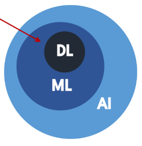
* AI
  - 주어진 환경/데이터를 인지, 학습, 추론을 통해 목표를 당성하돠록 예측, 행동 선택,계획하는 시스템

* ML
  - AI 범주 내에서 데이터로부터 학습하여 목적을 달성하는 접근 방법론
  - 예 : 생성형 AI, 언어모델, 이미지 분류 모델 추천 시슽메

* DL
  - ML 범주 내에서 신경망
  - 함수를 사용한 학습 방법론

* AI-ML(ML이 아닌 AI 시스템) 의 예
  - 규칙 기반 시스템
  - 휴리스틱 기반 (최적화) 알고리즘

# 2. 데이터, 모델, 학습  
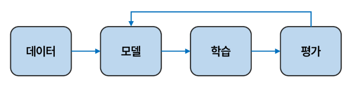
## 2-1. 데이터 구성요소
* 데이터가 왜 중요한가?
  - 머신러닝은 규칙을 직접 코딩하지 않고, 데이터에서 규칙을 학습
  - 데이터의 분포와 관계가 머신러닝의 학습 결과를 결정

* Feature
  - 모델이 예측에 사용하는 입력정보
  - 예측, 판단의 근거/단서

* Label
  - 모델이 예측하려는 정답
  - 학습의 목표값

* ML 실생활 예시
  - 유튜브 추천
    - Feature : 각 영상들의 정보, 사용자 정보
    - label : 영상에 대한 사용자 피드백

  - 스팸메일 분류
    - Feature : 메일 제목, 발신자, 단어 빈도
    - label : 스팸 / 정상

# 단일 피쳐 기반 학습
## 3-1. 1D 피쳐 기반 학습
* 1차원 피쳐 기반 학습 이란?
  - Feature가 하나일 때 머신러닝이 학습하는 가장 단순한 형태

## 3-2. 모델과 가설 공간
- 학습
  - `입력(Feature) -> 출력(Label)` 관계를 찾는 과정
  - 평균 관계를 하나의 함수로 표현
  - 하지만 관계를 포현할 수 있는 함수는 무수히 많음

- 가설 공간
  - 관계를 표현할 수 있는 모든 후보 함수들의 모음
  - 피쳐 공간과 라벨 공간 위에서 정의된 함수들의 집합
  * 가설 공간은 함수가 될 수 있는 후보들의 집합이다.
  * 가설공간은 내가 선택한다.

- 모델
  - 가설공간에 속한 특정 함수
  * 후보들 중에 고른 특정 함수

## 3-3. 학습이란
학습
- 주어진 데이터에서 정답을 가장 잘 맞출 수 있도록 모델의 규칙을 조금씩 조정해가는 과정
- 데이터 -> 가설 공간 -> 선택된 모델

* 학습에 필요한 3가지
  - 데이터
  - 가설공간
  - 선택기준(손실 함수)
    - 어떤 함수가 더 좋은지 판단하는 척도
    - 예측값과 실제값의 차이를 측정

* 학습 과정
1. 가설공간에서 하나의 함수를 선택
2. 그 함수로 데이터의 모든 예시를 예측
3. 손실함수로 틀린 정도 계산
4. 더 적게 틀리도록 함수의 파라미터 조정
5. 손실함수로 틀린 정도 계산

* 데이터 -> 가설공간 -> 선택된 모델 의 관점으로 생각해보기
 - 데이터가 제시한 문제를, 가설 공간이 제공한 선택지 중에서, 가장 잘 푸는 함수를 찾는 것이 학습

1. 데이터가 문제를 제시
2. 가설공간이 선택지를 제공
3. 학습이 최적의 F 를 선택

# 4. 복수 피쳐 기반 학습
## 4-1 2D 피쳐 기반 학습  
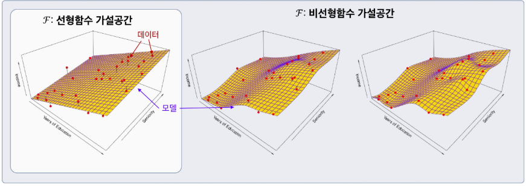

* 노란색 surface이 우리가 찾아낸 참 함수이다.

* 차원이 올라갈 수록 오차를 줄일 가능성이 커지는 것인가?  
-> 차원이 올라가면 더 정확하게 맞출 수 있기 때문에 오차를 줄일 수 있다. 다만 우리가 갖고있지 않은 데이터가 새로 들어왔을 때 그 데이터에 대해서도 오차가 작을까? 에 대해서는 아니다.

## 4-2. 일반적 용어 정리 및 모델 가정  

- Income : 우리가 예측하려는 라벨(반응/목표) 변수 -> Y로 표기
- Years of Education : 첫 번째 피쳐(입력/예측) 변수 -> X1로 표기
- Seniority : 두 번쨰 피쳐(입력/예측) 변수 -> X2로 표기
- 다른 i번째 피쳐가 있다면 역시 Xi 로 표기  
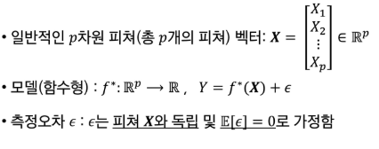
* R은 실수공간 E는 기댓값

## 4-3. 왜 f(.)를 학습하는가
* 예측
  - 잘 학습된 f가 있으면, 새로운 입력 X = x 에서 반응/목표 Y를 예측할 수 있음

* 중요 특성 파악

* 해석 가능성

# 지도 학습
## 1-1. 지도학습 이란?
- 정답 라벨이 있는 훈련 데이터를 사용해 예측 모델을 학습하는 방법
- 목표 : 훈련 데이터로 학습한 모델이 새로운 데이터에서도 정확한 예측을 수행

## 1-2. 지도학습의 종류 (회귀 vs 분류)
* 회귀
  - 예측하고 싶은 결과값이 숫자일 때 사용
  - 가격, 점수, 온도

* 분류
  - 예측하고 싶은 결과값이 범주일 때 사용
  - 스팸/정상, 질병 유/무

## 1-3. 손실 함수
- 모델의 예측이 정답에서 얼마나 벗어났는지를 하나의 숫자로 나타내는 함수
- 학습이란, 이 숫자가 작아지는 방향으로 모델을 조금씩 고쳐 나가는 과정

* 회귀 : 평균제곱오차(MSE)
  - 정답과 예측의 차이를 제곱해서 평균낸 값

* 분류 : 교차 엔트로피(Cross Entropy)
  - 정답 범주에 얼마나 높은 확률을 주었는지 측정

* 손실함수의 값이 클 수록 예측에서 벗어났다 -> 모델이 잘 못 되었다.

## 1-4. 지도학습 용어
* 특성 (Feature)

* 라벨 (Label, y)

* 예측값 (y햇)

* 오류 (Error) : 손실 함수로 계산
  - 예측값과 라벨의 차이 : y(헷) - y

* 예측값과 실제값의 차이(오류)를 줄이는 것이 지도학습의 목표
* 여기서의 오류는 엡실론이 아니다.
* 엡실론은 학습으로 줄일 수 없다. 학습의 목적은 엡실론을 줄이는 것이 아니다.

# 2. 회귀
## 2-1. 회귀 문제
* 정의 : 입력(feature)으로부터 숫자(ouput)를 얼마나 정확하게 예측할까?
* 특징 : 라벨 및 예측 모델으 출력은 연속적인 수치

## 2-2. 회귀 오류 : 평균제곱오차(MSE)
예측이 얼마나 정확한지 어떻게 알 수 있을까?
- 모델의 예측 정확도를 숫자로 측정하는 지표 필요

* 평균제곱오차
  - 각 데이터에서 정답과 예측의 평균 제곱 차이값 (에러값은 +던 -던 나쁜 것이기에 제곱)
  - 틀린 정도를 제곱해서 더 큰 오류에 패널티 부여

* 참고 : MSE 단위가 제곱이라 해석이 어렵다면?
  - 원래 데이터와 같은 단위라서 해석이 쉬운
  - RMSE(MSE의 제곱근)도 사용

## 2-3. 회귀 설명력 : R^2 (결정계수)
결정계수
- Label의 분산 중에서 Feature로 설명되는 비율
- "평균만 쓰는 단순한 예측" 보다 모델이 실제값을 얼마나 더 잘 맞추는 지를 0~1 사이 값으로 나타냄
- 1에 가까울수록 설명력이 높고, 낮을수록 설명력이 낮음
  
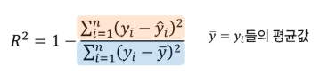
* 분모에 있는 것은 모델링 하나도 안 하고 y값 평균으로 예측한 것에 대한 에러
* 분자에 있는 것은 각각의 예측값에 대한 에러

* 결정 계수가 1에 가까우면 가까울 수록 좋은 것이다.

## 2-4. MSE vs R^2
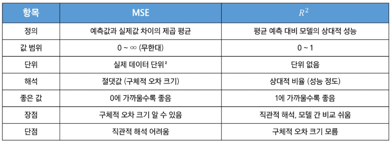

# 분류
## 분류(Classification) 문제
* 정의 : 입력 특성으로부터 출력이 범주값(카테고리)으로 나타나는 예측 문제
* 특징 : 범주 라벨(이진/다중)

## 3-2. 분류 정확도 (Accuracy)
* 분류모델은 Label이 범주로 돼 있기 때문에 MSE나 R^2를 사용하기 어렵다
  
정확도
* 전체 예측 중에서 올바르게 맞춘 예측의 비율  
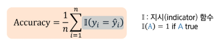

* 기억해두자  
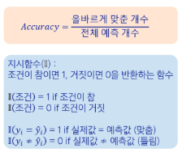

### 정확도 99%가 정말 좋은 지표일까?
- 불균형 데이터(양성 1%, 음성 99%)에서는 전부 음성이라 해도 정확도가 99%로 보일 수 있음
* 정확도는 단순히 "전체 중 맞춘 비율" 만 계산함
* 정확도만 보지 말고 다른 지표도 함께 봐야 안전

## 3-3. 혼동 행렬 (Confusion Matrix)
예측값과 실제 값 사이의 관계를 행렬 형태로 표현  
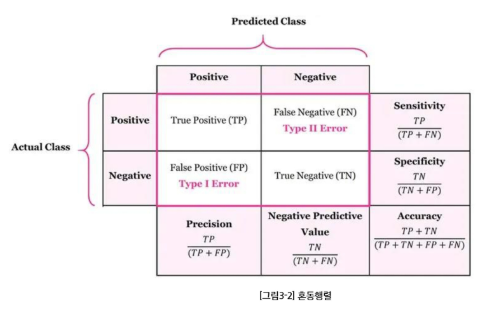
* TP : 실제 양성, 예측도 양성
* TN : 실제 음성, 예측도 음성
* FP : 실제는 음성인데 양성이라 함 (오탐)
* FN : 실제는 양성인데 음성이라 함 (누락)

* 정밀도
  - "양성이라 판정한 것 중" 진짜 양성의 비율 = TP/(TP+FP)

* 재현율
  - "진짜 양성 가운데" 잡아낸 예측 양성 비율 = TP/(TP+FN)

* F1-score
  - 정밀도와 재현율의 조화평균
  - F1 = 2 x (정밀도 x 재현율) / (정밀도 + 재현율)

## 3-4. 분류 손실 : 교차 엔트로피
정확도만 보고 학습할 수 있을까?
- 정확도, 혼동행렬은 핛브이 끝난 결과를 "평가" 하는 지표
- 맞음/틀림만 세므로, 예측 확률이 0.51에서 0.95로 좋아져도 값은 그대로
- 학습 중에는 "정말을 얼마나 확신했는지" 까지 반영하는 손실ㅇ ㅣ필요
  
교차 엔트로피
- 정답에 준 확률이 높을수록 손실이 작아짐
- 확률이 낮으면 손실이 급격히 커짐  

# 4. 학습의 목적
## 4-1. 학습의 목적
학습의 목적 : 새로운 데이터에서 예측하기
- 목적 : 훈련 데이터로 학습한 모델이 새로운 데이터에서도 정확한 예측을 수행하도록 하는 것
  
훈련이 잘 됐는지 어떻게 확인할까? (모델 성능을 어떻게 평가할까?)
- 학습 모델의 성능 평가는 모델이 처음 보는(학습에 사용되지 않는) 데이터로 평가
- 훈련 데이터에서 성능이 아무리 좋아도, 새로운 데이터에서 성능이 떨어지면 실전엔 사용할 수 없음

## 4-2. 오버피팅이란?
과적합
- ***훈련 데이터의 우연한 패턴/잡음까지 외워버려서*** (초록색 함수) 훈련에서는 잘 맞지만 테스트에서는 성능이 나빠지는 현상
- 현상 : 훈련 오류 급격히 낮음 테스트는 오류 높은/요동  
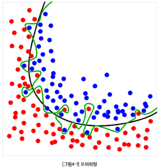  
  
오버피팅이 왜 안 좋은가?
- 표본 의존, 불안정 : 훈련 데이터는 모집단의 일부 표본이라 우연한 잡음이 섞임. 이 것에만 과하게 맞추어 학습하면 샘플 몇 개만 바뀌어도 예측이 크게 흔들림 (분산 up)
- 일반화 실패 : 보지 못한 데이터(테스트) 오류가 커짐, 모(population)집단 성능과 격차가 벌어짐

## 4-3. 오버피팅에 대한 오해
오버피팅 != 분포 변화로 인한 에러 증가
- 분포 변화로 인한 오류 : 훈련 데이터 분포와 테스트 분포가 다름으로 성능이 떨어지는 현상
- 분포 변화로 인한 에러 증가는 모델이 과적합하지 않아도 발생 가능

## 4-4. 오버피팅 vs 언더피팅
* 오버피팅 : 모델이 너무 복잡 -> 잡은까지 학습 (테스트 성능 나쁨)
* 언더피팅 : 모델이 단순하거나 학습이 완료됮 않음 -> 중요한 패턴을 놓침 (오류 큼)

# 교차 검증
## 1. 테스트 성능 평가
훈련 오류 vs 테스트 오류  
- 훈련 오류 : 모델을 학습시킨 같은 데이터에 다시 적용해 계산한 오류
- 테스트 오류 : 학습에 쓰지 않은 새 관측치에 대해 모델을 적용했을 때의 평균 예측 오류
- 보통 훈련 오류는 테스트 오류와 다르며, 특히 훈련 오류는 테스트 오류를 (심하게) 과소평가하는 경우가 많음  
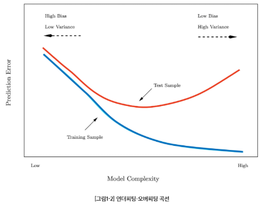
  
테스트 예측 오류 계산
- 이상적 케이스 : 충분히 큰 별도 테스트 데이터셋 -> 현실에선 구하기 어려움
- 현실에서는 테스트만을 위한 데이터를 갖기에 데이터 자체가 부족할 수 있음
  
대안 : 재표본화(resampling)를 통한 테스트 오류 추정
- 데이터를 나눠 여러 번 "훈련-> 평가"를 반복해 테스트 오류를 가늠
- 방법 : 검증셋, k겹 교차검증
- 장점 : 별도의 테스트 데이터 없이 데이터를 더 효율적으로 사용하여 일반화 오차 추정

## 2-1. 검증셋 방법
- 가용 샘플들을 무작위로 훈련셋과 검증셋으로 분할
- 훈련셋으로 모델 적합, 검증셋으로 예측 후 검증 오류를 계산
- 검증 오류는 보통 정량 반응은 MSE, 범주 반응은 오분류율을 측정한다

## 2-2. 검증셋 절차
- 데이터 순서 무작위 셔플링 후 두 부분으로 분할 : 왼쪽 = 훈련셋, 오른쪽 = 검증셋
- 학습은 훈련셋에서, 성능평가는 검증셋에서 수행

## 2-4. 검증셋 접근의 한계
왜 전체 데이터로 학습한 모델의 테스트 오류를 과대 추정하는 경향이 있을까?
- 학습에 데이터를 부분만 사용하기 때문

## 3-1. K-겹 교차검증
k-겹 교차검증
- 테스트 오류 추정의 표준적 접근
  - 문제집을 5등분 해서 서로 다른 모의고사를 5번 보는 것
- 추정치는 모델 선택과 최종 모델의 테스트 오류 규모 파악에 활용
- 데이터 전체를 크기 동일한 k개 폴드로 무작위 분할
- k=1, ..., K에 대해 반복 후, 평균 오류로 테스트 오류를 추정
  
k-겹 교차검증 단계
- 데이터를 먼저 셔플링한 뒤, 총 n개의 데이터를 겹치지 않는 k개 그룹으로 분할
- 각 그룹이 번갈아 검증셋, 나머지는 훈련셋
- k개의 MSE를 평균해 테스트 오류를 추정
* K겹 교차검증은 각 fold마다 새로운 모델을 처음부터 학습한다. (첫 폴드에서 학습한 폴드를 다음에 검증으로 쓸 일이 없음)

## 3-2. k-겹 교차검증 오류 계산

## 3-3. Leave-One-Out 교차검증
- n 개의 데이터가 있다면 n개의 폴드를 만들겠다!!
- 검증셋이 단 1개이다. 나머지는 전부 훈련셋

## 3-4. k-겹 교차검증 비교
10-겹 CV 추정이나 LOOCV 추정이나 결과는 비슷하게 나온다.

# 비지도학습
## 1. 비지도학습
- 정의 : 레이블(정답) 없이 데이터의 구조, 패턴, 집단(잠재 서브그룹)을 찾아내는 학습
- 대표 과제 : 군집화(Clustering), 차원 축소(PCA 등), 밀도추정/이상치 감지
- 출력 : "정답 예측"이 아니라 구조/요약/표현(embedding)
  
핵심 질문
- 무엇을 비슷함/다름으로 볼 것인가(거리, 유사도 선택)
- 전처리 (스케일 표준화 등)를 어떻게 할 것인가

비지도 vs 지도학습
- 지도학습 : 입력 + 라벨(정답)로 예측 모델 학습
- 비지도학습 : 입력만으로 구조 학습
  - 클러스터링 : 서로 비슷한 데이터끼리 묶어 동질 그룹 만들기

## 2. 클러스터링 (Clustering)
- 클러스터링 : 데이터 안에서 하위 집단 (클러스터)을 찾는 기법들의 총칭
- 집단 내부는 서로 유사, 집단 간은 상이하도록 데이터를 분할
- 유사/상이는 문제, 도메인에 따라 달라짐
- 특성에 따라 클러스터가 잘 안 보이거나, 알고리즘마다 결과가 달라질 수 있음
  
두 가지 대표 클러스터링 기법
- K-평균 (K-means) : K(클러스터 수)를 미리 정해 분할
- 계층적 군집(Hierarchical) : K를 사전에 고정하지 않음

## 3. K-means 클러스터링
## 3-1. K-means 클러스터링
- 패널 : K=2,3,4에서 각 K-means 결과
- 클러스터 결과에서 특정 색상은 의미가 없고, 점들이 다른 색이라는 것은 서로 다른 클러스터에 속해 있다는 의미  
  
K-means의 표기
- 모든 다른 클러스터 k != k'에 대해 Cluster(k)와 Cluster(')는 서로 교집합이 없다.
  - 하나의 데이터가 여러 그룹에 동시에 속할 수 없음
  
핵심 아이디어
- 좋은 군집화 = 클러스터 내부 변동이 작은 분할
- 목표 : 클러스터 거리, 차이의 합이 최소가 되도록 데이터를 나누는 것

## 3-2. K-means 클러스터링 알고리즘
1. 초기화 : 관측치들에 무작위로 1...K 클러스터를 임시 부여
2. 반복(할당이 더 이상 바뀢 않을 때까지):
  2a. 각 클러스터의 중심(centroid) 계산(특성 평균 벡터)
  2b. 각 관측치를 가장 가까운 중심의 클러스터에 재할당(거리 예 = 유클리드)
  
K-means 알고리즘 특성
- 중심점과의 평균 거리가 계속 줄어들기 때문에 매 반복마다 결과는 더 좋아짐
- 하지만 최적 해를 항상 찾는 건 아님 -> 초기값에 따라 지역 최솟값을 수렴 가능
  -> 지역 최소값 문제라고 부름

## 3-5 K-means 클러스터링에서 초기값의 영향
다른 초기값의 영향
- 서로 다른 초기 레이블에서 최종 분할과 목표값 (패널 상단 숫자)이 달라짐
* 초가화의 중요성 : 여러번 시도 권장

## 4-1. 계층적 군집
K-means 클러스터링 vs 계층적 군집
- k-means는 클러스터 수 K를 미리 지정해야 하는 단점이 존재함
- 계층적 군집은 K를 미리 지정해야 하는 단점이 존재함
- 계층적 군집은 K를 고정하지 않고 전체 구조를 덴드로그램으로 제공
- 이번 강의에서는 상향식을 다룸 : 잎 -> 몸통으로 병합 

계층적 군집 결과 예시
- 덴드로그램에서 수평선 높이(거리)를 기준으로 가위질하여 K개 군집을 얻음
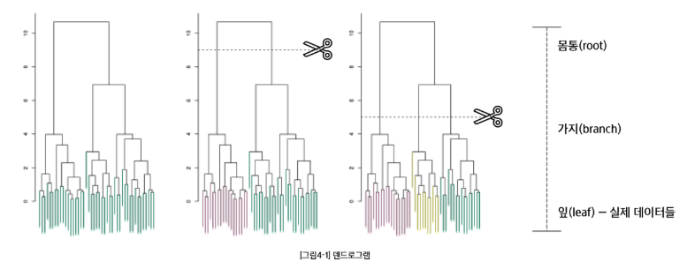  

* 계층적 군집 에서 높이가 높으면 높을 수록 자르기가 용이하다.

## 4-2. 계층적 군집 알고리즘(상향식)
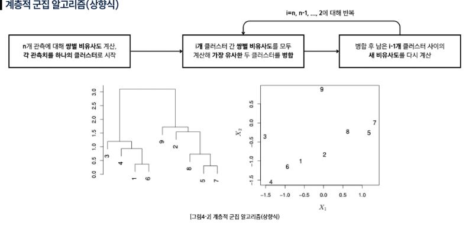  
* 계층적 군집 알고리즘은 클러스터 끼리의 합쳐짐 과정
* 데이터 포인트가 자기 클러스터인 것이다.
* 하나의 클러스터로 뭉쳐지는 과정에서 가까운 클러스터들 끼리 먼저 뭉쳐진다.
* 어디에서 자를 것인지는 내가 정한다.

## 4-3. 계층적 군집 단계별 진행
- 데이터들이 점차 큰 클러스터로 합쳐지는 과정
- 매 단계에서 클러스터들끼리 병합이 이루어짐
- 1개의 단일 클러스터가 될 때까지 진행

계층적 군집의 계산량
- 매 단계에서 모든 클러스터 쌍 간의 거리를 계산해야 함.
- 데이터의 수가 많은 경우 K-means에 비하여 계산량이 많음

## 4-4. 계층적 군집의 링크 유형
- Single (최소거리) 링크 : 두 개 클러스터 내 데이터 쌍별 거리 중 최소값을 군집 간 거리로
- Complete (최대거리) 링크 : 두 개 클러스터 내 데이터 쌍별 거리 중 최대값을 군집 간 거리로
- Average (평균거리) 링크 : 두 개 클러스터 내 데이터 쌍별 거리의 평균을 군집 간 거리로

## 4-5. 링크 유형에 따른 계층적 군집 결과
- 같은 데이터라도 링크 선택에 따라 클러스터링 결과(덴드로그램)가 달라질 수 있음
- 하나의 링크만 시도하는 것이 아니라 다른 종류의 링크도 사용 권장

# 5. 클러스터링 시의 주의점
- 스케일 : 표준화(평균 0, 표준편차 1 로 입력 변수 변환) 가 필요한가?
  - Yes, 변수 단위 차이 큼!

- 몇 개의 클러스터가 적합한지
  - K-means 계층적 모두 어려운 문제, 합의된 정답 없음.

- 단일 시도가 아닌 여러번 시도 권장됨