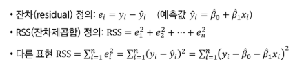
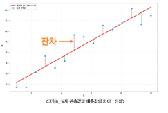
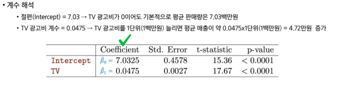
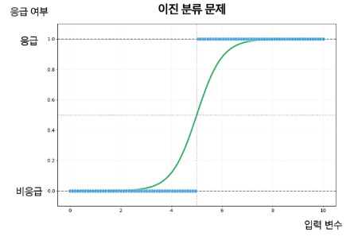
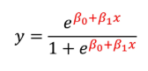

# 8월 4일
# AI 강의1
### List
* 파이썬의 list는 C와는 다르게 메모리에 연속된 공간을 차지하는 것이 아니라 인덱스 별로 개별 공간을 갖고 list가 주소를 갖는 방식이다. (링크드 리스트 형식)

### Dict
- `{ Key : Value }`쌍으로 이루어져 있다

### List와 Dict의 차이
| 구분 | list | dict |
| --- | --- | --- |
|찾는법|순서(인덱스)|이름(key)|
|언제|순서가 있는 데이터|이름표가 붙은 데이터|
|예|점수 목록|한 사람 정보|

### list 인덱싱
* 인덱싱 : [i]를 이용해 리스트의 특정 값에 접근하는 방법
* 파이썬의 리스트는 마이너스 인덱싱도 가능하다 [-1]

### list 슬라이싱
* list[ start : end : step ]

### list 메서드
- append(value) : 리스트의 마지막에 값을 추가
- insert(index, value) : 인덱스 n 번째에 값을 추가
- pop() : 마지막의 값을 제고하고 그 값을 반환
- remove(value) : 입력한 값을 찾아 제거
- sort() : 기존 리스트를 직접 정렬
- sorted() : 정렬된 새로운 리스트를 반환

### dict 메서드
`dict{ key : value }`
키 접근법
- dict["key"]
- dict.get("key")

### list와 dict 의 중첩 구조

### 조건문
- if, elif, else

### 반복문
- for (변수) in (반복할 대상):
- for i in range(3):
- for ... else : for에서 순회 범위를 전부 순회하면 else 문이 실행된다. 그 전에 break 되면 실행 X

### 함수 
- def 함수이름(매개변수):

### 함수의 호출 스택과 스코프
1. greet("김싸피")를 호출해 함수 실행
2. 함수 안에서 지역 변수 message 생성
3. return message로 값을 반환하고 함수 종료
4. 반환된 값을 result에 저장
5. 함수가 종료되면 지역 변수 message에 접근할 수 없음

### 지역변수와 전역변수

## API, HTTP, requests 기초
### API
- 서버와 클라이언트 사이에서 request와 response 를 중개해주는 역할

### Request와 Response
- 클라이언트 : 서버에 요청(request)를 전송
- 서버 : 요청을 처리한 수 응답(response)을 반환
- URL : 요청한 자원의 위치를 나타내는 주소

### HTTP 메서드
- HTTP 요청은 목전에 따라 서로 다른 메서드를 사용함
  - GET : 데이터를 조회
  - POST : 데이터를 전송하거나 생성을 요청
  - PUT : 기존 데이터 전체를 수정
  - PATCH : 기존 데이터 일부를 수정
  - DELETE : 데이터를 삭제
  - OPTIONS : 사용할 수 있는 메서드를 확인

### 상태 코드
- 서버가 요청을 처리하는 결과를 숫자로 나타낸 값
- 200 : 요청 성공
- 404 : 요청한 자원을 찾을 수 없음
- 500 : 서버 내부 오류

### response 객체
- requests.get() : 서버의 응답을 Response 객체로 반환
  - status_code : HTTP 상태 코드
  - text : 문자열 형태의 응답 본문
  - json() : JSON 응답을 파싱해 파이썬 객체로 변환
  - header : 응답 헤더
  - elapsed : 응답에 걸린 시간
  - url : 실제로 요청한 URL

## JSON
### JSON 구조
- 배열 : 여러 사용자의 객체를 순서대로 저장
- 객체 : 사용자 한 명의 정보를 키와 값으로 저장
- 중첩 객체 : address, company 처럼 객체 안에 저장된 객체
- response.json()으로 변환하면 배열은 리스트, 객체는 딕셔너리가 됨

### JSON 데이터 접근

### get() 메서드
- dict["key"]
- dict.get("key")
- dict.get("key", defalt)

### 필요한 값 추출
- API 응답에는 현재 작업에 필요하지 않은 필드도 포함될 수 있음
- 반복문으로 각 데이터에 접근해 필요한 키의 값만 추출

### API 키 보안
- 키 보안 하는 방법 2가지
- OS에 환경변수로 설정하는 법
- .env 에 API_KEY를 관리하는 법

## NumPy 와 Pandas
- Pandas : 표 형태의 데이터를 다루며 내부적으로 NumPy 배열을 활용
- 배열(ndarray) : 숫자 데이터를 처리하는 NumPy의 다차원 자료구조

### 리스트와 NumPy 배열
파이썬 리스트 연산
- 리스트의 덧셈은 각 원소를 더하지 않고 두 리스트의 연결
- 리스트에 숫자를 곱하면 각 원소를 계산하지 않고 리스트를 반복
- 각 원소에 대해 계산하려면 반복문을 이용해 값을 하나씩 처리
- 가격 리스트에 10% 할일을 적용하려면 각 가격별 개별적으로 계산해야 함

### NumPy 배열의 특징
- 배열(ndarray) : 같은 자료형의 데이터를 담는 다차원 자료구조
- 벡터화 : 반복문을 직접 작성하지 않고 배열 전체에 연산을 적용
- 연산 속도 : 벡터화된 연산을 이용하면 일반적으로 반복문보다 빠르게 처리 가능
- 집계 함수 : mean, sum, max, min, std 등을 이용해 배열 값을 계산

### NumPy 배열의 연산 속도
- 리스트 : 각 객체의 참조를 저장하며 반복문으로 값을 하나씩 처리
- NumPy 배열 : 같은 자료형의 데이터를 연속된 메모리 공간에 저장하며 배열 전체를 벡터화 연산으로 처리

* 리스트와 NumPy는 출력을 했을 때 `,` 가 있냐 없냐로 구분할 수 있다. 리스트는 , 가 있고, NumPy는 없다.
* NumPy 의 차원에 따라 0차원은 스칼라, 1차원은 벡터, 2차원은 텐서 라고 표현한다.

### NumPy 배열 생성
배열 만들기
* np.array(리스트) : 리스트를 NumPy 배열로 변환
* np.arange(n) : 0 부터 n-1 까지의 정수로 배열을 생성
* np.zero(n)m np.ones(n) : 0 또는 1로 채운 배열을 생성
* np.linspace(a, b, n) : a부터 b까지 같은 간격의 값 n개를 생성
* .shape : 배열의 각 차원 크기를 확인

* .shape를 했을 때, 1차원의 크기가 4라고 쳤을 때 (4, ) 로 나온다. 이러한 튜플 형태에 `,` 를 후행 쉼표라 하며 1차원이라는 것을 나타내는 것이다.

### 백터 연산
- 배열과 숫자의 연산은 배열의 모든 원소에 적용
- 크기가 같은 배열끼리 연산하면 같은 위치의 원소를 계산
- 반복문을 작성하지 않고 배열 전체를 처리

### 2차원 배열
- np.array([[1,2,3], [4,5,6]]) : 2차원 배열을 생성
- arr.reshape(행, 열) : 1차원 배열을 지정한 행과 열의 2차원 배열로 변환
- arr.T : 배열의 행과 열을 전환
- .shape : 배열의 행과 수를 반환

### reshape와 축 연산
- reshape(행, 열) : 원소 수를 유지하면서 배열 형태를 변경
- -1 : 전체 원소 수에 맞춰 해당 차원의 크기를 계산
- axis = 0 : 열별로 값을 집계
- axis = 1 : 행별로 값을 집계

### 브로드캐스팅
크기가 다른 배열을 연산할 수 있도록 작은 배열을 확장하는 방식
- 1차원 배열과 스칼라 : 스칼라를 배열의 모든 원소에 적용
- 크기가 같은 1차원 배열 : 같은 위치의 연소끼리 연산
- 1차원 배열과 2차원 배열 : 크기가 연산 조건에 맞으면 1차원 배열을 축에 따라 확장해 연산
* 작은 배열이 큰 배열의 크기를 맞출 수 있는 배열이어야 연산이 가능하다. (보통 뒤에 요소가 맞으면 계산 가능)

### 조건부 필터링
- 배열[조건] : 조건이 True인 위치의 원소만 추출
- * : 두 조건을 모두 만족하는 원소를 선택
- | : 두 조건 중 하나 이상을 만족하는 원소를 선택
- 여러 조건을 결합할 때에는 각 조건을 괄호로 구분

### 정렬
- np.sort(배열) : 원본을 유지하고 오름차순으로 정렬한 배열을 반환
- 배열[::-1] : 배열의 순서를 반대로 변경
- np.argsort(배열) : 배열을 오름차순으로 정렬할 인덱스 순서를 반환

## Pandas
* 데이터에서 하나의 열(컬럼)을 series 라고 한다. 이러한 시리즈 들이 모여서 만들어진 것이 DataFrame 이다.

### 언제 NumPy를 쓰고 Pandas 를 쓰는가?
- Pandas : 데이터를 읽고, 정리하고, 탐색하는 단계(전처리)
- NumPy : 정리가 끝난 순수 숫자 행렬을 계산하는 단계(학습)

* dataframe을 만드는 것은 Pandas가 하고 train, test, valid 셋을 만드는 것은 NumPy.

* Pandas = 이름표(labeling) 달린 NumPy + 엑셀의 기능

### DataFrame과 Series
- DataFrame : 행과 열로 구성된 2차원 표
- Series : DataFrame의 한 열을 구성하는 1차원 자료구조
- DataFrame은 열마다 다른 자료형을 사용할 수 있음

### DataFrame의 구조

### DataFrame으로 하는 일
- 조회 : haed(), info()로 일부 데이터와 자료형을 확인
- 필터 : df[]으로 조건을 만족하는 행을 선택
- 집계 : groupby()로 데이터를 그룹별로 묶어 요약
- 분석 과정 : 파일 불러오기, 조회, 집계, 시각화 순서로 진행

### 조회 메서드
- head() : 위에서 n개 행을 확인
- tail() : 아래에서 n개 행을 확인
- info() : 컬럼, 자료형, 결측값 확인
- describe() : 수치형 데이터으 요약 통계를 확인
- shape : 행과 열의 수를 확인
- dtypes : 각 컬럼의 자료형을 확인
- cloumns 컬럼 이름을 확인

# 8월 5일

## 전처리의 중요성
- 데이터가 정확할수록 분석과 집계 과정의 오류가 줄어듦
- 잘못된 데이터를 입력하면 결과도 잘못될 수 있음
- 데이터 전처리 : 결측치 보정, 이상치 처리, 정규화, 인코딩을 수행하는 작업

* 쓰레기 값이 입력되면 쓰레기 값이 출력된다.

범주형에는 막대 그래프가 좋지

## 차트를 선택하는 법
- 데이터 특성에 적합한 차트를 고르면 데이터 비교, 추이 분석, 분포 파악이 용이함
- 차트를 잘못 지정하면 데이터 정보를 왜곡하거나 흐리게 만들기 때문에 유의해야 함(시계열을 막대로 그리면 추이가 안 보임)

## 기본 차트
- bar : 막대그래프로 범주별 값을 비교
- line : 꺾은선 그래프로 시간에 따른 변화를 확인
- scatter : 산점도로 두 값의 관계를 확인
- hist : 히스토그램으로 값으 분포를 확인
- 값 비교 : 막대그래프
- 변화 추이 : 꺾은선 그래프
- 변수 관계 : 산점도

### Seaborn

### 전처리 4대 작업
- 결측치 : 비어 있는 값을 채우거나 해당 데이터를 제거
- 이상치 : 다른 값보다 지나치게 크거나 작은 값을 확인하고 처리
- 정규화 : 서로 다른 값의 범위를 같은 기준으로 조정
- 인코딩 : 범주형 데이터를 숫자로 변환

### 결측치, 이상치 찾기
- df.isnull().sum() : 컬럼별 결측치 개수를 확인
- df.describe() : 최솟값과, 최댓값 등으로 이상치의 단서를 확인
- 상자 그림과 히스토그램으로 값의 분포를 확인
- 값을 처리하기 전에 결측치와 이상치가 발생한 원인을 확인

### 차트 그리기
- plt.bar() : 막대 그래프 생성
- plt.plot() : 꺾은선 그래프 생성

### 결측치 채우기
- fillna(값) : 결측치를 지정한 값으로 대체
- 평균 : 모든 값의 평균으로 결측치를 대체
- 중앙값 : 이상치의 영향을 줄여 결측치를 대체
- 값을 대체하기 전에 선택한 값이 데이터에 적합한지 확인

### 결측치 대체, mode
최빈값으로 결측치 대체

### apply 함수 적용
- 

### 탐색적 자료 분석
- 수집한 데이터가 들어왔을 때 이를 다양한 각도에서 관찰하고 이해하는 과정
  - 데이터를 분석하기 전에 그래프나 통계적인 방법으로 자료를 직관적으로 바라보는 과정
- 탐색적 자료 분석의 필요성
- 탐색적 자료 분석은 과학에서 분석과정에서 핵심적은 부분으로 주요 과정은 다음과 같음
  - 분석의 목적 설계 및 데이터 확보
  - 데이터 탐색 (Null, N/A, Outlier 등)
  - 데이터 값 관찰 및 반환

### 탐색적 자료 분석 실습
1. 문제 정의 및 목표 설정
2. 모듈 import
3. 데이터셋 로드
4. 기본 데이터 조회
5. 탐색적 데이터 분석(EDA)
6. 전처리

# 8월 6일
# 선형회귀
## 1-1. 선형회귀
- 입력 변수와 출력 변수 사이의 관계를 직선 형태로 근사하여, 예측하는 통계적 방법
- 지도학습의 가장 기초가 되는 접근 중 하나이다.

# 2. 단순선형회귀
- 한 개의 설명변수(X)와 하나의 반응변수 (Y) 사이의 선형(직선) 관계를 찾는 방법
- 목표 : 데이터를 가장 잘 설명하는 직선을 찾아 예측(Y_hat)에 활용

## 2-2. 최소제곱법
- 실제 관측값과 예측값의 차이(잔차, residual)를 제곱해 합한 값(RSS, 잔차제곱합)을 최소화하는 방법
- 목표 : 데이터를 가장 잘 설명하는 직선을 찾기 위해 계수  
  

  
* 최소제곱법의 목적은 잔차제곱합이 최소가 되는 선을 찾는 것이다.

## 2-3. 단순선형회귀 : 광고 데이터

* t-statistic = Std.Error / Cofficient
* Intercept는 절편, TV는 기울기
* 선형성이 크다 작다는 p-value를 보면 된다.
* p-value는 5%가 기준이다?

# 3.다중선형회귀
- 독립 변수(설명 변수, Feature)가 여러 개 존재할 때 사용하는 회귀 분석 기법
- 한순 선형 회귀는 하나의 변수만 고려하지만, 다중 선형 회귀는 여러 독립 변수(X1, X2, ...)를 동시에 고려하여, 종속 변수(Y)와의 관계를 구함

# 선형회귀 시 주의사항
## 4-1. 검증/테스트셋 데이터를 활용한 성능 평가
- 훈련 데이터에서의 성능
  - 회귀식을 만들 때 최소제곱 해는 훈련 데이터만 보고 계산됨
  - 학습에 사용된 훈련 데이터에서는(X과 Y의 평균적인 선형관계가 있다면) 적합이 잘 되어있을 것임
  - 그러나 이것은 테스트 성능을 과소평가할 가능성이 높음

## 4-2. 다중선형회귀시 회귀계수 해석의 주의점
- 이상적 상황 : 변수들이 연관되지 않고, 독립적일 떄 -> 계수 해석이 명확함
- 문제상황 : 변수들이 서로 연관되어 있다면 -> 계수 추정이 불안정해지고 해석에 혼동이 발생할 수 있음
- 주의 : 관찰 데이터의 상관관계로 인과 관계를 주장해서는 안 됨
  
# 로지스틱회귀
## 1-1. 분류란?
- 분류 : 정해진 범주(카테고리) 중 하나로 지정하는 것
- 범주형 변수 : 수치의 크고 작음이 아니라 유한한 범주 (성별, 혈액형, 지역 등)로 표현하는 변수
  
분류 함수의 목표
- 입력 (X, 특성 벡터) : 눈동자 이미지, 이메일 내용/제목
- 출력 (Y 포함 C, 범주) : 예, 눈동자 색 C = {black, brown, blue, green} 등, 순서없는 집합
- 분류 함수의 목표
  - 분류 함수 f(x)를 학습하여 입력 x가 속할 범주(카테고리)를 예측
  - 범주의 직접 예측보다 각 범주에 속할 확률 P(Y=k|X)를 추정하는 것이 더 유용할 떄가 많음

## 1-3. 분류 문제에 선형회귀를 써도 될까?
- 선형회귀는 선형함수를 계산하는 문제로 예측 값이 (Y값 기준) 제한된 값을 갖지 못함.
- 따라서 선형회귀는 ***예측 확률이 0보다 작거나 1보다 크게 예측*** 될 수 있어 확률로 쓰기 ***부적절함***.

## 1-4. 분류 문제에서 적합한 모델
분류 문제에서 선형회귀의 대안 - 로지스틱 회귀
- 시그모이드 함수를 활용해 0~1 범위 내 확률값 예측 보장
- 순서가 없는 범주를 확률로 예측하는 적절한 분류 방법
  

## 2-1. 로지스틱 회귀의 모형식
이진 분류에서의 적절한 함수  
- 함수의 출력 범위가 모든 입력에 대해 0~1 사이의 범위를 갖는 함수를 활용

출력 범위가 0~1인 시그모이드 함수
- 기울어진 S자 형태의 곡선 함수
- 모든 실수 Z에 대한 y값의 범위는 0 (<= y <= 1) 이다.
  
로지스틱 회귀의 모형식
- 시그모이드 함수에 회귀식 z = B + B1x 식을 대입한 것
  

- 확률 표기 p(x)를 활용한다면, 로지스틱 회귀의 모형식이 된다.

## 2-2. 로지스틱 회귀 모형 vs 선형 모형 (어려움)
로지스틱 함수와 선형회귀의 관계  
- 로지스틱 함수는 선형 함수를 내포하고 있다
- 이 두 함수 간의 관계를 해석하기 위해 오즈(Odds)와 로짓변환에 대해 알아보자

오즈(Odds)
- 오즈(Odds)란, 성공(y=1) 확률이 실패(y=0) 확률에 비해 몇배 더 높은가를 나타낸다.
- odds = 성공확률 / 실패확률
  
로짓 변환(logit) = Log odds
- 로짓변환은 오즈에 log를 취한 함수 형태
- Log(성공확률 / 실패확률)
  
로지스틱 함수와 선형회귀의 관계
- 로지스틱 함수 모형식에 로짓 변환을 수행하면 선형 모형식이 나온다!!!
- 즉, ***로지스틱 모형***식은 ***선형*** 모형식과 ***시그모이드 함수의 결합***이며, 
***로짓 변환***시 ***선형***회귀 모형식으로 표현이 가능하다.

## 2-3. MLE 활용 모수 추정
우도 (Likelihood)
- 확률을 추정하는 모델을 결정했으니, 모수(B0, B1)를 추정하는 방법에 대해 알아보자
- 선형회귀에서 "현재 함수가 데이터와 오차가 작은지"를 평가하기 위해 평균 제곱 오차(MSE)를 지표로 삼았듯, 확률을 계산하는 함수를 평가하기 위해선 우도를 지표로 삼는다.
- 우도란 "현재확률 함수가 데이터를 얼마나 잘 설명하는지"를 나타낸 지표이다.
  
로지스틱 회귀의 우도 최대화
- 로지스틱 회귀와 같은 이진 분류 문제에서 우도를 최대화 한다.
* 하나는 최대한 1에 가깝게, 하나는 최대한 0에 가깝게

- 하지만, 위와 같은 곱으로 이뤄진 함수의 경우, B 에 대해 미분이 어렵기 떄문에
양 변에 Log를 취해 곱셈을 덧셈으로 변환시킨 뒤 log-likelihood를 만들어 최대화 한다.

- Log L(B)를 미분하여 도함수 = 0 에 근접하도록 수치적(반복) 최적화를 통해 B들을 찾아 나간다.

# 1. 모수적 함수로서의 선형 모델
## 1-1. 단순(1D) 선형 모델: 모수적 함수

# 2. Shallow 네트워크
## 2-1. Shallow 네트워크
정의  
- 입력층 - 은닉층 1개 - 출력층으로 구성된 1개의 은닉층만 가진 신경만 구조
  
장점
- 복잡한 비선형 패턴까지 학습가능
- 구조가 간단해 삼습속도가 빠르고 구현이 쉬움
- 데이터가 충분하지 않아도 과적합 위험이 비교적 낮음
  
사용 예시
- 간단한 분류 및 회귀 문제
- XOR 같은 비선형 결정 boundary가 필요한 문제

## 2-2. Shallow 네트워크 : 활성화 함수
- ReLU[z] : z가 0 이하면 0이고, z가 0 이상이면 z 값이 출력된다.

## 3-3. 보편적 근사 정리
"Hidden unit을 충분히 많이 갖는다면, 얕은 신경망은 임의의 연속함수를 임의의 정밀도로 근사할 수 있음"

# 4. 다중출력/입력
## 4-1. 2개 출력의 네트워크
  - 출력이 두 개 더라도 꺾이는 위치는 갖다. Hidden unit은 같으니까

## 5-4. Shallow 네트워크와 Deep 네트워크 비교
- Deep 네트워크 은닉층이 2개 hidden unit이 6개라 하면 파라미터 수 20개, 조각적 선형 구역 최대 16개
- Shallow 은닉층 1개 hidden unit 6개라 파라미터수 19개 조각적 선형 구역 최대 7개
* 선형 구역 표현력이 차이가 크다!

