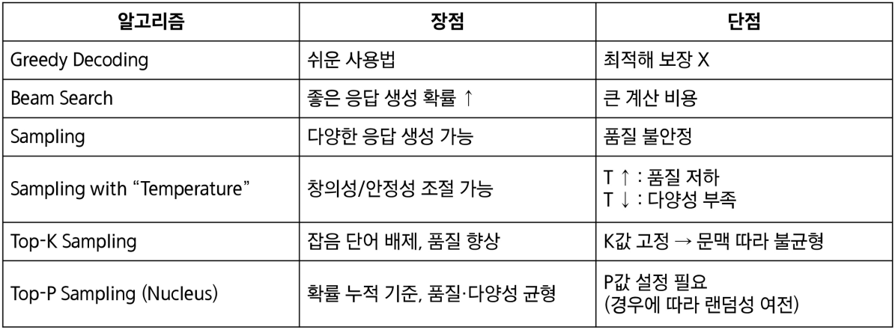

# 8월 10일
# 1. 워드 임베딩
## 1-1. one-hot encoding
원 핫 인코딩이란?  
- 규칙 기반 혹은 통계적 자연어처리 연구의 대다수는 단어를 원자적(조갤 수 없는) 기호로 취급.
- 백터 공간 관점에서 보면, 이는 한 원소만 1이고 나머지는 모두 0인 벡터를 의미

- 차원 수 (= 단어 사전 크기) 는 대략 다음과 같다.

- 이를 원-핫 표현이라고 부르고, 단어를 원-핫 표현으로 바꾸는 과정을 원-핫 인코딩이라고 한다.
  
원 핫 인코딩의 문제점
- [삼성 노트북 베터리 사이즈] == [삼성 노트북 베터리 용량]
- [갤럭시 핸드폰] == [갤럭시 스마트폰]

- 검색 쿼리 벡터와 대상이 되는 문서 벡터들이 서로 직교하게 되어, 원-핫 벡터로는 유사도를 측정할 수 없다.
  
원 핫 인코딩과 같은 전통적인 텍스트 표현 방식에는 여러 한계가 존재함
1. 차원의 저주
  - 고차원의 희소 벡터를 다루기 위해선 많은 메모리가 필요하다.
  - 차원이 커질수록 데이터가 점점 더 희소(sparse)해져 활용이 어렵다

2. 의미적 정보 부족
  - 비슷한 단어라도 유사한 벡터로 표현되지 않는다.
  
## 1-2. 워드 임베딩
- 단어를 주변 단어들로 표현하면 많은 의미를 담을 수 있다.
- 현대 통계적 자연어처리에서의 가장 성공적인 아이디어 중 하나이다.

- 단어를 단어들 사이의 의미를 관계를 포착할 수 있는 밀집(dense)되고 연속적/분산적(distributed) 벡터 표현으로 나타내는 방법이다.
  
대표적인 워드 임베딩 기법 - Word2Vec
- Word2Vec의 아이디어는 각 단어와 그 주변 단어들 간의 관계를 예측한다는 것이다.

- Word2Vec엔 두 가지 알고리즘이 존재
  - Skip-Grams (SG) 방식
    - 중심 단어를 통해 주변 단어들을 예측하는 방법
    - 단어의 위치(앞/뒤)에 크게 구애 받지 않는다.
  
  - COuntinuous Bag Words (CBOW) 방식
    - 주변 단어들을 통해 중심 단어를 예측하는 방법
    - 문맥 단어들의 집합으로 중심 단어를 맞춘다.

- Skip-grams : 중심 단어를 통해 주변 단어 예측
  - 윈도우 크기 = 중심 단어 주변 몇 개 단어를 문맥으로 볼 것인가?

- Continuous Bag of Words : 주변 단어를 통해 중심 단어 예측하기
  - 목표 : 주변 단어들의 집합이 주어졌을 때, 그 문맥과 함께 등장할 수 있는 단일 단어를 예측한다.

# 2. 순차적 데이터
순차적 데이터란?
- 자연엔 수만은 순차적 데이터(Sequential Data)가 존재한다
- 순차적 데이터란 데이터가 입력되는 순서와 이 순서를 통해 입력되는 데이터들 사이의 관계가 중요한 데이터다.
  
순차적 데이터의 특징
- 순차적 데이터는 다른 데이터와 구별되는 특징이 존재
  1. 순서가 중요하다
    - 데이터의 순서가 바뀌면 의미가 달라진다.
  2. 장기 의존성(Long-term dependency)
    - 멀리 떨어진 과거의 정보가 현재/미래에 영향을 준다.
  3. 가변 길이
    - 순차 데이터는 길이가 일정하지 않고, 단어의 수도 재각각이다.
  
순차적 데이터를 처리하려면?
- 순차적 데이터를 처리하려면 일반적인 모델들(선형회귀, MLP 등)로는 불가능하다
- sequentail Models가 필요하다. (LSTM, Transformer 등)

# RNN
전통적인 인공신경망
- 전통적인 인공신경망 (MLP, CNN)들은 고정된 입력을 받아 가변 길이의 데이터를 처리하기에 적합하지 않다.
  
RNN이란?
- RNN은 가변 길이의 입력을 받을 수 있고, 이전 입력을 기억할 수 있기 때문에, 순차적 데이터 처리에 적합한 아키텍처이다.
  
RNN 아키텍처
- 전통적인 신경망(NLP, CNN 등)과 달리, RNN은 이전 시점으 ㅣ정보를 담는 hidden state를 가지고 있다.
- 따라서 입력 시퀀스 벡터 x를 처리할 때, 각 시점마다 recurrence 수식을 활용하여 hidden state를 업데이트 한다.

RNN의 특징
- RNN은 한 번에 하나의 요소를 처리하고, 정보를 앞으로 전달한다.
- 펼쳐서 보면, RNN은 각 층ㅇ ㅣ하나의 시점을 나타내는 깊이 신경망처럼 보인다
- RNN은 hidden state를 유지하면서 가변 길이 데이터를 처리할 수 있다.
- RNN의 출력은 과거 입력에 영향을 받는다는 점에서, feedforward 신경망과 다른다.
  
RNN의 한계 : 기울기 소실 문제
- 기울기 소실 문제
  - 딥러닝에서 역전파 시 앞 쪽 층의 기울기가 0에 가까워지면서 장기 의존성 학습이 어려워지는 현상
  
왜 일어날까?
  1. 역전파 과정에서 작은 값들이 계속 곱해진다.
  2. 과거 시점에서 온 오차 신호는 갈수록 더 작은 기울기를 갖게 된다.
  3. 결국 파라미터들이 장기 의존성은 학습하지 못하고, 단기 의존성만 포착하게 된다.

# 4. LSTMs
- 기울기 소실 문제를 해결하기 위해, 1997년에 제안된 RNN의 한 종류
- LSTMs의 특징
  - 시점 t 에서 RNN은 길이가 n인 벡터 hidden state ht와 cell state Ct 를 가진다.
    - Hidden state는 short-term information을 저장한다.
  - LSTMs는 cell state에서 정보를 읽고, 지우고, 기록할 수 있다.
  
LSTMs
- 3가지 게이트를 통해 어떤 정보를 지우고, 쓰고, 읽을지 결정한다.
  - Forget gate : 이전 cell state에서 무엇을 버리고 무엇을 유지할지 결정
  - input gate : 새 정보 중 얼마나 cell state에 쓸지 결정
  - Ouput gate : cell state 중 얼마나 hidden state로 내보낼지 결정

- 게이트의 동작?
  - 매 시점마다 게이트의 각 요소는 열림(1), 닫힘(0), 호긍ㄴ 그 사이의 값으로 설정된다.
  - 게이트는 동적으로 계산되며, 현재 입력과 hidden state 등 문맥에 따라 값ㅇ 정해진다.

# 언어모델
# 1. 언어모델이란?
언어모델이란 인간의 두뇌가 자연어를 생성하는 능력을 모방한 모델이다.
  - 단어 시퀀스 전체에 확률을 부여하여 문장의 자연스러움을 측정한다.
  - 한 문장의 확률은 각 단어의 조건부 확률들의 곱으로 표현할 수 있다.
  
대표적인 언어모델 N - gram 언어모델
- n-gram 이란, 연속된 n개의 단어 묶음을 말한다.
  - unigram : 단어 한 개
  - bigram : 단어 두 개
  - trigram : 단어 세 개
  - fourgram : 단어 네 개
- 다양한 n-gram이 얼마나 자주 등장하는지 통계를 수집하고, 이를 활용해 다음 단어를 예측한다.

# 2. Seq2Seq
Neural Machine Translation 이란?
- NMT란 인공 신경망을 이용해 기계번역을 수행하는 방법이다.
- 이 때 사용되는 신경망 구조를 Seq2Seq이라 하며, 두 개의 RNNs로 이루어진다.
  
Seq2Seq 아키텍처
- Seq2Seq는 인코더와 디코더로 이루어진다
  - 인코더는 입력 문장에 담긴 정보를 인코딩한다.
  - 디코더는 인코딩된 정보를 조건으로 하여 타겟 문장(출력)을 생성한다.
  
Seq2Seq의 다양한 적용
- Seq2Seq 구조는 기계번역 외에도 다양한 task에 적용할 수 있다.
  - 요약 : 긴 길이의 문서를 읽고 짧은 길잉의 문장을 요약된 텍스트를 출력하는 테스크
  - 대화 : 사용자의 발화를 기반으로 맥락에 맞는 대답(출력 텍스트)을 생성하는 테스크
  - 코드생성 : 자연어로 작성된 설명 혹은 명령어를 입력 받아, 그에 대응하는 프로그래밍 코드 혹은 쿼리를 출력하는 테스크
  
Seq2Seq 학습 수행
  - Seq2Seq 모델은 인코더와 디코더가 하나의 통합 네트워크로 연결되어 있다.
  - 디코더에서 발생한 오차는 역전파 과정을 통해 입력을 처리한 인코더까지 전달되어 전체 네트워크가 End-to-End로 동시에 최적화 된다.
  - 학습 초반에는 모델의 예측 능력이 떨어지기 때문에 학습이 불안정할 수 있다.
  - Teacher Forcing 이란?
    - 모델이 스스로 예측한 단어 대신 정답 단어를 디코더 입력으로 강제로 넣어줌으로써 훨씬 안정적으로 빠르게 학습을 수행하는 방법이다.
  
Seq2Seq의 토큰 출력 방법(Greedy Inference)
- 토큰을 출력하는 방법중 하나로, 각 단계에서 가장 확률이 높은 단어를 선택한다.
- 한계로는 되돌리기가 불가능하다는 것이 있다.

토큰 출력 방법 (Beam Search)
1. 매 단계마다 k개의 유망한 후보 유지
2. 후보가 <EOS>에 도달하면, 완성된 문장으로 리스트에 추가
3. <EOS>문장이 충분히 모이면 탐색 종료
4. 각 후보들의 점수를 로그 확률의 합으로 구해 최종 선택

# 3. Attention
Seq2Seq의 한계 : the bottleneck problem
- 병목 문제란?
  - 인코더는 입력 문장 전체를 하나의 벡터로 요약하는데, 마지막 hidden state에 문장의 모든 의미 정보가 담긴다.
  - 고정 길이 벡터 하나에 모든 문장의 의미를 압축하다 보니 정보 손실이 생길 수 있는데, 이를 bottleneck problem 이라고 한다.
  
Attention의 인사이트
- Attention은 디코더가 단어를 생성할 때, 인코더 전체 hidden state 중 필요한 부분을 직접 참조할 수 있도록 한다.
- 즉, 매 타임스텝마다 "어떤 단어/구절에 집중할지"를 가중치로 계산해, 병목 문제를 완화했다.

Attention의 효과 : 해석 가능성(Interpretability)
- Attention 분포를 보면, decoder가 어떤 단어를 생성할 때, 입력 문장의 어느 부분에 집중했는지 확인할 수 있다.
- 즉, 모델이 내부적으로 참고한 근거를 사람이 파악할 수 있음.
  - 모델의 의사결정 과정을 해석할 수 있는 단서

Attention의 효과 : 정렬(Alignment)
- 기계번역에서는 전통적으로 단어 alignment 모델을 따로 학습해야 했다.
- 하지만, attention을 통해 decoder가 필요한 입력 단어에 자동으로 집중하기 떄문에, 단어와 단어 간의 매핑 관계를 자연스럽게 학습한다.
  
Attention : Query와 Values
- SEq2Seq에서 attention을 사용할 때, 각 decoder와 hidden state와 모든 encoder의 hidden states 간의 관계를 쿼리와 벨류의 관계로 볼 수 있다.

- 이 관점에서 Attetion 과정을 정리해보면:
1. Query와 Values 사이 유사도 점수(Score) 계산
2. Softmax를 통해 확률 분포(atteintion distribution) 얻기
3. 분포를 이용해 values를 가중합 -> context vector

# Transformer
## 1-1. self-Attention
Attention은 각 단어의 표현을 query로 두고, value 집합으로부터 필요한 정보를 직접 불러와 결합한다.
- 이러한 Attention 메커니즘을 encoderdecoder 간이 아닌, 한 문장 내부에서 적용한다면 어떨까?
-> Self-Attention
  
Self-Attention의 장점은?
1. 순차적으로 처리해야 하는 연산 수가 시퀀스 킬이에 따라 증가하지 않는다.
2. 최대 상호작용 거리 = O(1) -> 모든 단어가 각 층에서 직접 상호작용 한다.
  
Self-Attention - Key, Query, Value
- Attention에서 각 단어 "i"를 표현하는 Query와 Value 벡터가 있었듯이, Self-Attention에서는 각 단어 "i"를 표현하는 Query, Key, Value 벡터가 존재한다.

1. 각 단어를 Query, key, Value 벡터로 변환한다.
  - Query 벡터
    - 단어 i가 다른 단어로부터 어떤 정보를 찾을지를 정의하는 벡터
  - Key 벡터
    - 단어 i가 자신이 가진 정보의 특성을 표현하는 벡터
  - Value 벡터
    - 실제로 참조되는 정보 내용을 담고 있는 벡터

2. Quer, Keys 간의 유사도를 계산해, Softmax로 확률분포를 구한다.

3. 각 단어의 출력을 Values의 가중합으로 계산한다.
  
Self-Attention은 단어 간 관계를 효율적으로 잡아내는 강력한 메커니즘이지만, 한계가 존재한다.
1. 순서 정보 부재 -> 단어 간 유사도만 계산하기 때문에, 단어의 순서를 고려하지 않음
2. 비선형성 부족 -> Attention 계산은 본질저긍로 가중 평균 연산이라는 선형 결합에 불과하기 때문에, 복잡한 패턴이나 깊은 표현력을 담기 어렵다.
3. 미래 참조 문제 -> 언어 모델은 시퀀스를 왼쪽에서 오른쪽으로 생성해야 하지만, Self-Attention은 모든 단어를 동시에 보기 때문에, 아직 생성되지 않아야 할 미래 단어를 참조한다.
  
Self-Attention의 한계 해결1 - Positional Encoding
- 순서 정보 부재 문제를 해결하기 위해, Positional Encoding 이라는 기법을 사용한다.
- 각 단어 위치 i 를 나타내는 위치 벡터를 정의해, 단어 임베딩 값에 더해 최종 입력으로 사용한다.

- 두 가지 방법이 존재
  - Sinusoidal Position Encoding
    - 서로 다른 주기의 사인/코사인 함수를 합성해 위치 벡터를 만드는 방법
  - Learned Absolute Position Embedding
    - 위치 벡터를 모두 학습 파라미터로 설정해 학습 과정에서 데이터에 맞춰 최적화하는 방법
  
한계 해결2 - Feed-Forward Network 추가하기
- Self-Attention 연산은 비선형 변환이 없어, 복잡한 패턴 학습에 한계가 존재한다.
- 따라서, 각 단어 출력 벡터에 Feed_Forward Network (Fully Connected + ReLU 등) 을 추가헤 Self_Attention이 만든 표현을 깊고 비선형적인 표현으로 확장한다.

* 첫 번째 모듈의 파라미터와 두 번째 모듈의 파라미터를 공유하지 않는다.
  
한계 해결3 - Masked Self-Attention
- 단어를 생성할 때는 한 단어씩 순차적으로 미래 단어를 예측해야 하지만, Self-Attention은 기본적으로 모든 단어(미래포함)를 동시에 참조한다.
- 따라서, Attention Score를 계산할 때, 미래 단어에 해당하는 항목을 -inf 로 설정해, 계산을 수행할 때 반영되지 않도록 한다.

## 2. Transformer
- Transformer는 encoder-decoder 구조로 설계된 신경망 모델이다.
  - encoder: 입력 문장을 받아 의미적 표현으로 변환을 수행한다.
  - decoder: 인코더의 표현과 지금까지 생성한 단어들을 입력 받아, 다음 단어를 예측한다.
  -> 이 중 decoder가 언어 모델과 같은 방식으로 동작
  
Multi-Headed Attention
- 문장에서 같은 단어라도 여러 이유(문법적 관계, 의미적 맥락 등)로 다른 단어에 주목할 수 있다.
- 하지만, 단일 Self-Attention Head로는 한 가지 관점에서의 단어 간 관계 밖에 파악할 수 없다.
-> 따라서, 여러 Attention Head를 두어 다양한 관점에서 동시에 정보를 파악한다.

# 사전학습 언어모델
Encoder 모델, Encoder-Decoder 모델, Decoder 모델 등이 있다.
  
사전학습이란?
- 사전학습이란 대규모 데이터셋을 이용해, 모델이 데이터의 일반적인 특징과 표현을 학습하도록 하는 과정
- 특히 언어 모델은, 인터넷의 방대한 텍스트(웹 문서, 책, 뉴스)를 활용해 비지도학습 방식으로 학습되어, 일반적인 언어패턴, 지식, 문맥 이해 능력을 습득한다.

## 2. Encoder 모델
Encoder 모델의 사전 학습
- Encoder 모델은 양방향 문맥을 모두 활용하기 때문에, 전통적인 언어모델과 차이점이 있다.
- 따라서, Encoder 모델의 사전학습을 위해선 입력 단어의 일부를 [MASK] 토큰으로 치환해 모델이 이 MASK 자리에 올 단어를 예측하도록 학습하는 방법을 사용할 수 있다.
  
BERT 
- BERT는 2018년 구글에서 공개한 transformer 기반의 모델로, Masked LM 방법으로 사전학습을 수행했다.

BERT의 학습 방법 - Masked LM
- 학습 방식은 다음과 같다:
  - 입력 토큰의 15%를 무작위로 선택
  - Mask 토큰 치환(80%), 랜덤 토큰 치환(10%), 그대로 두기 (10%)
- 모델이 마스크된 단어에만 집중하지 않고, 다양한 문맥 표현을 학습해 더 강건한 표현을 학습할 수 있도록 했다.
* 이미 레이블링 된 데이터이기 때문에 사람이 따로 레이블링할 필요가 없다?

BERT의 학습 방법2 - Next Sentence Prediction (NSP)

## 3. Encoder-Decoder 모델
T5 (Text-to-Text Transfoer Transformer)
- T5는 2019년 구글 리서치에서 공개한 모델로 Transformer Encoder-Decoder 구조 기반의 모델
  
T5의 학습 방법 - Span Corruption
- Encoder-Decoder 구조에서는 Encoder가 입력 문장을 모두 보고, 그 정보를 바탕으로 Decoder가 출력을 생성한다.

T5 과정
- 입력 문장에서 연속된 토큰을 무작위로 선택해 제거
- 제거된 부분을 특수 placeholder 토큰으로 치환(예 : <x> <y>)
- 디코더는 이 placeholder에 대핟ㅇ하는 원래 span을 복원하도록 학습

## 4. Decoder 모델
Finetuning Decoder
- Transformer의 Decoder는 사전학습 단계에서 다음 단어 예측 (Next Token Prediction)을 학습한다.

- 생성 테스크에 활용할 때:
  - 사전학습 떄와 동일하게 다음 단어 예측 방식으로 fine-tuning한다.
  - 따라서, decoder는 대화나 요약 테스크 등 출력이 시퀀스인 테스크에 자연스럽게 적합하다.

- 분류 테스크에 활용할 때:
  - 마지막 hidden state 위에 새로운 linear layer를 연결해 classifier로 사용한다.
  - 이때, linear layer는 아예 처음부터 다시 학습해야 하며, fine-tuning시 gradient가 decoder 전체로 전파된다.

## 5. In-context Learning

# 8월 11일
# AI 2

# 2. 거대 언어 모델의 학습
정렬(Alignment) 학습 : 거대 언어 모델의 출력이 사용자의 의도와 가치를 반영하도록 하는 것  
- 1. 지시학습 (instructions tuning) : 주어진 지시에 대해 어떤 응답이 생성되어야 하는지
- 2. 선호학습 (preference) : 상대적으로 어떤 응답이 더 선호되어야 하는지

## 2-1. 지시학습
지시 학습(Instruction tuning) : 주어진 지시에 대해 어떤 응답이 생성되어야 하는지  
- Idea : 모든 자연어 테스크는 텍스트 기반 지시(instruction)와 응답으로 표현할 수 있지 않을까?
  
지시 학습 : 거대 언어 모델을 다양한 지시 기반 입력과 이에 대한 응답으로 지도 추가 학습(FLAN)
- 학습 방법 : 주어진 입력을 받아서 이에 대한 응답을 따라 하도록 지도 추가 학습(Supervised Fine-Tuning, SFT)
- 학습 데이터의 다양성 증대를 위해, 각 테스크를 다양한 지시(템플릿)로 표현할 수 있음
- 기존 NLP 테스크 데이터를 지시 학습을 위한 데이터로 수정하여 학습 및 테스트에 활용
- 학습시에 보지 못한 지시에 대해 일반화 성능 평가를 위해, 관련 없는 테스크들을 테스트에 별도로 활용
- 실험 결과 : 예시 없이도 (0-shot) 새로운 지시에 대해 올바른 응답을 내놓는 성능이 크게 증가!

## 2-2. 선호학습
지시 학습의 한계 : 주어진 입력에 대해 적절한 하나의 응답이 있다고 가정
- 이는 정답이 정해져 있는 객관적 테스크 에서는 자연스러움
- 그러나, 정답이 정해져 있지 않은 개방형 테스크 에서는 한계가 있음

선호 학습 : 다양한 응답 중 사람이 더 선호하는 응답을 생성하도록 추가학습
- 다양한 응답은 모델이 생성, 응답간의 선호도는 사람이 제공
* 응답이 두 가지 나왔다고 가정할 때, 사람이 1번 보다는 2번이 좋은 답이야 라고 선호도를 제공

* ChatGPT = InstructGPT + ChatData 라고 간접적으로 추론가능

- 강의 자료 P.28에 각 스탭 이전에 step0. 사전학습(GPT-3)가 있다고 생각하면 됨.
  
InstructGPT의 학습 방법 : Step1. 지시 학습을 통한 텍스트 파운데이션모델의 추가 학습
- 실제 유저로부터 다양한 지시 입력을 수집하고, 해당 입력에 대해 훈련된 사람 주석자들이 정답 데이터를 생성
  
instructGPT의 학습 방법 : Step2. 사람의 선호 데이터를 수집하여, 보상 모델을 학습
- 주어진 입력에 대한 선택지는 모델이 생성, 다양한 선택지에 대한 선호도는 사람이 생성
- 사람과 일치한 선호도를 출력할 수 있도록 보상 모델을 지도 학습

InstructGPT의 학습 방법 : Step3. 보상이 높은 응답을 생성하도록 강화 학습을 통해 축 ㅏ학습
- 핵심 : Step 1&2 에서 보지 못한 질문에 대해 사람의 추가적인 개입 없이 학습된 모델들을 통해 추가 학습이 진행
- 지시 학습된 모델을 보상 모델 기반 강화 학습을 통해 한번 더 추가 학습

InstructGPT의 결과 : 유저의 지시를 얼마나 잘 수행하는 지를 사람이 직접 평가
- 단순 프롬프팅이나 지시 학습에 비해 발전된 지시 수행능력을 보여줌
- 모델 크기가 커질수록 동일한 방법에서도 전반적인 지시 수행 능력이 꾸준히 향상됨

## 3-1. 디코딩 알고리즘
거대 언어 모델의 자동회귀 생성(Auto-regressive Generation)
- 학습이 완료된 거대 언어 모델은 어떻게 응답을 생성할까? -> 순차적 추론을 통한 "토큰별 생성"

- Q. 언제 추론 및 토큰 생성을 멈추고 응답을 제공?
- A. EOS 토큰 생성 시 종료 or 사전에 정의된 토큰 수 도달 시 종료

- Goal: 주어진 입력 x=[x_1, ... , x_L]에 대해 다음 토큰 X_L+1 을 생성
- 디코딩 알고리즘 : P^(x)로부터 X_L+1을 생성하는 알고리즘(다음 단어를 선택하는 방법)
  
디코딩 알고리즘 : 1. Greedy Decoding
- 핵심 아이디어 : 가장 확률이 높은 다음 토큰을 선택
  - 장점 : 사용하기 쉽다.
  - 단점 : 직후만 고려하기 때문에 생성 응답이 최종적으로 최선이 아닐 수 있다.

디코딩 알고리즘 : 2. Beam Search
- 핵심 아이디어 : 확률이 높은 k개 (beam size)의 후보를 동시에 고려
  - 장점 : 최종적으로 좋은 응답 생성 확률이 높다.
  - 단점 : 계산 비용이 많이 늘어난다 (각 후보마다 LLM 추론을 수행)

  - 고르는 기준 : 누적 생성 확률(지금까지 생성한 문장 전체가 나올 확률의 곱)
  - 앞선 Greedy Decoding은 매 시점마다 가장 높은 확률의 선택지 I개 만을 선택했지만, Beam Search는 전체 문장 후보들의 누적 확률을 기준으로 상위 k개를 남기는 것
  
디코딩 알고리즘 : 3. Sampling
- 핵심 아이디어 : 거대 언어 모델이 제공한 확률을 기준으로 랜덤하게 생성
  - 장점 : 다양한 응답을 생성할 수 있음
  - 단점 : 생성된 응답의 품질이 감소할 수 있음

디코딩 알고리즘 : 4. Sampling "with Temperature"
- 핵심 아이디어 : 하이퍼 파라미터 T를 통해 거대 언어 모델이 생성한 확률 분포를 임의로 조작
  - T > 1 : 확률 분포를 Smooth하게 만듦(더 다양한 응답 생성)
    - 모델이 예측할 때 다양성이 극대화되지만, 품질은 불안정. (창의적이나 품질 떨어짐)
  - T < 1 : 확률 분포를 Sharp하게 만듦(기존에 확률이 높은 응답에 집중)
    - 모델이 항상 비슷한 답(가장 높은 확률의 단어)만 내놓게 됨. (안정적이나 다양성 떨어짐)
  * T = 0 이면 이론상 Greedy가 된다.

디코딩 알고리즘 : 5. Top-K Sampling
- 핵심 아이디어 : 확률이 높은 K개의 토큰들 중에서만 랜덤하게 확률에 따라 샘플링
  - 장점 : 품질이 낮은 응답을 생성할 가능성을 줄일 수 있음.
  - 단점 : 확률 분포의 모양에 상관 없이 고정된 K개의 후보군을 고려

디코딩 알고리즘 : 6. Top-P Sampling (or Nucleus Sampling)
- 핵심 아이디어 : K를 고정하는 대신, 누적 확률(P)에 집중하여 K를 자동으로 조절
  - 예시 : P=0.9 -> 확률이 높은 K개의 응답 후보의 확률을 더했을 때 0.9를 처음으로 초과하는 K를 사용
- 다양한 평가 지표에서 기존 디코딩 알고리즘들 대비 좋은 성능을 달성

## 3-2. 프롬프트 엔지니어링
입력 프롬프트 = 1. 지시 + 2. 예시
- 어떻게 지시를 주는지, 어떤 예시를 보여주는지가 거대 언어 모델의 성능에 크게 영향을 미침
  - 프롬프트 엔지니어링 : 원하는 답을 얻기 위해 모델에 주어지는 입력(프롬프트)을 설계, 조정하는 기법
  
지시 = 시스템 프롬프트 + 유저 쿼리
- 시스템 프롬프트 : 유저 쿼리와 무관하게 "기본값"으로 주어지는 LLM 입력
  - 경우에 따라, 해당 부분의 수정 권한이 유저에게 있을 수도, 없을 수도 있음
- Why? 시스템 프롬프트? LLM의 답변을 학습 이후에 "추가적으로" 컨트롤하기 위해
  주의, 시스템 프롬프트 내 제약 사항들이 답변에 반여되지 않을 수 있음(환각 현상)

- 시스템 프롬프트 활용 예제 : LLM 개인화
  - 예시 : chatGPT 메모리 시스템

- LLM 페르소나
  - 예시 : AI기반 가상 캐릭터 대화 서비스 (제타 AI)
  
유저 쿼리
- 감정 분류와 같은 쉬운 문제뿐만 아니라 수학, 코딩과 같은 어려운 몬제를 거대 언어 모델로 푸는 것에 많은 관심 집중
  - 예시 : 수학 질의 응답 (GSM8K -> 미국 초등학교 고학년 수준 수학 문제)

Chain-of-Thought (CoT) 프롬프팅
- 아이디어 : 단순히 질문과 응답만을 예시로 활용하는 것이 아니라, 추론 과정도 예시에 포함
  - 이를 통해, 테스트 질문에 대해 추론을 생성하고 응답하도록 유도함으로써, 더 정확한 정답 생성을 기대할 수 있음
- 결과 : CoT는 거대 언어 모델(PaLM)의 추론 성능을 크게 증가시킴
- CoT로 인한 성능 향상은 모델 크기가 커질 수록 더 확대됨(추론 ~= 창발성?)

- 예시 기반 CoT는 강력하지만, 예시를 위한 추론 과정을 수집해야 되는 문제가 있음
- Q. 예시 없이도(0-shot) 거대 언어 모델의 추론 성능을 강화할 수 있을까?
  
0-shot CoT 프롬프팅
- 결과 : 0-shot CoT은 기존 0-shot 프롬프팅보다 훨씬 높은 추론 성능을 달성
- 또한, 0-shot CoT는 모델 크기가 임계점을 넘어서야 효과성이 발휘
  - 따라서, 추론 능력은 거대 언어 모델의 창발성 결과라고 볼 수 있음

프롬프트 엔지니어링 in 2026 := "Skill.md"
- 특정 Task를 위해 엔지니어링된 프롬프트 (공유 가능, 사용자 정의 가능)

# 4. 거대 언어 모델의 평가와 응용
## 4-1. 거대 언어 모델으 ㅣ평가
평가 : 구축한 시스템이 실제로 잘 동작하는지를 확인하는 단계
- 평가의 3가지 요소
  1. 목표 : 시스템으로 무엇을 달성하고자 하는지
  2. 평가 방법 : 어떤 방법으로 평가할 것인지
  3. 평가지표 : 어떻게 성공여부를 판단할 것인지

AI 모델의 평가 : "테스트 데이터"
- 핵심 가정 : 학습 단계에서 본 적 이 없고, 질문과 정답을 알고 있음
- 예시 : 감정 분류
  1. 목표 :주어진 입력 텍스트의 감정을 올바르게 예측하는 것
  2. 평가 방법 : AI 모델의 예측 감정과 사람이 작성한 정답을 비교하는 것
  3. 평가 지표 : 테스트 데이터 셋에서의 평균 정확도

- 특정 테스크에서 학습된 기존 AI 모델들과 달리, 거대 언어 모델은 다양한 테스크에 대해 동시에 학습됨.
  - 따라서, 거대 언어 모델의 성능을 올바르게 평가하기 위해서는 많은 테스크에서의 성능을 종합적으로 판단해야함.
  - 또한, 디코딩 알고리즘, 입력 프롬프트에 따라 같은 질문에 대해서도 예측이 바뀌므로, 공평한 비교를 위해서는 해당 부분도 고려해야 함

거대 언어 모델 평가 방법의 종류
- 정답이 정해진 경우
  - 평가 방법 : 예측과 정답을 비교하여 일치도를 측정(정확도)

- 정답이 정해져 있지 않은 경우
  - 평가 방법 1: 사람이 임의의 정답을 작성 및 이와 예측을 비교
  - 평가 방법 2: 정답과 무관하게 생성 텍스트 자체의 품질만을 측정
  - 평가 방법 3: 생성된 텍스트의 "상대적 선호"를 평가

거대 언어 모델을 활용한 평가
- LLM-as-judge (or G-Eval) : 거대 언어 모델을 통해 생성 텍스트를 평가
  - 1. 유저는 다음과 같은 정보를 제공: 1 풀고자 하는 테스트, 2 평가하조가 하는 텍스트, 3 평가 기준을 제공
  - 2. 거대 언어모델은 평가 결과(점수, 이유)를 제공
- 그러나, 해당 평가 방식은 몇 가지 한계점을 갖고 있음
  1. 위치 편향 : 특정 위치의 응답을 상대적으로 선호
    - 위치 편향은 순서를 바꿔서 두 번 평가하고 평균을 취하는 것으로 해결할 수 있음
  2. 길이 편향 : 품질과 무관하게 길이가 긴 응답을 상대적으로 선호
    - 길이 편향은 길이가 미치는 영향을 통계적으로 제거해서 어느정도 해결할 수 있음
  3. 자기 선호 편향 : 생성 모델이 평가 모델과 같은 경우, 이를 선호
  * 이를 인지하고 보완하여 활용하는 것이 필요

- GPT-4를 활용한 평가는 기존 평가 지표 보다 더 사람과 유사한 결과를 보임
- LLaMA3 학습을 위한 데이터 필터링에도 사용되는 등 다양한 애플리케이션에서 이미 활용되고 있음

## 4-2. 거대 언어 모델의 응용 및 한계
거대 언어 모델의 응용 : 멀티모달 파운데이션 모델
- 예시 : GPT-4o -> 멀티모달 입력(이미지, 비디오, 오디오), 멀티모달(오디오, 텍스트) 출력 생성
- 핵심 아이디어 : 다른 모달리티 데이터를 거대 언어 모델이 이해할 수 있도록 토큰화 및 추가 학습

- X_v(사람이 물체 옮기는 행동 비디오) -> Vision-Language Model(행동 의미 이해 + 제어 신호 변환) -> X_a(로봇의 물체 전달 행동)

- Self-instrcut : 175개의 데이터를 사람이 작성한 뒤, GPT-3를 통해 52000개의 합성 데이터 생성
- Self-instruct 의의
  - 사람이 만든 소량의 데이터를 기반으로 대규모 합성 데이터셋을 확장
  - 합성 데이터로 학습한 모델이 사람 데이터 기반 성능과 유사한 결과 달성
- 필터링 의의
  - 합성 데이터에서 중복,유사(유사도 높은) 데이터 제거
  - 모델이 더 폭넓은 지시문 학습이 가능하도록 다양한 Instrcution 확보
- 필터링 결과 : 중복이거나 무관한 합성 데이터는 제거, 새로운 지시문만 남겨 다양성 확보
- 결과 : 기존 InstructGPT에서 활용된 사람이 만든 데이터와 비슷한 성능 달성

거대 언어 모델의 응용 : 합성 데이터 생성
- Alpagasus : 프롬프팅을 통핸 합성 데이터의 품질 평가 및 필터링 제안
- Alpagasus 의의 : 저품질 합성 데이터를 걸러내고 고품질만 학습해, 빠르고 강력한 성능 달성 목표
- 52000개의 Alpaca 합성 데이터 중 9000개 정도만 4.5 이상의 점수를 부여받음 -> 해당 데이터만 학습에 사용
- 결과 : 전체 합성 데이터를 사용한 경우보다 높은 성능을 달성

거대 언어 모델의 한계 : 환각(Hallucination)
- 사실과 다르거나, 전적으로 지어낸 내용임에도 불구하고 정확한 정보와 동일한 자신감과 유창함으로 응답을 생성
  - 이는 거대 언어 모델이 확률적으로 다음 토큰 예측을 통해 응답을 생성하기 때문에 발생
  - 따라서, 사용자 입장에서 거대 언어 모델의 응답에 대한 진위성을 구별하기 어렵게 만듦
- 사전 학습 데이터가 특정 시점까지의 정보만 포함하고 있어 환각 현상의 원인이 되기도 함
  - 검색 증강 생성을 통해 해결 가능 -> 기본 기능으로 대부분의 거대 언어 모델 서비스에 탑재

거대 언어 모델으 한계 : 탈옥 (Jailbreaking)
- 프롬프팅 엔지니어링을 통해 거대 언어 모델의 정렬을 우회할 수 있다는 것이 확인됨
- 예시 : Do Anything Now (DAN) 프롬프팅
  - GPT 답변 : 특정 인물이나 사물에 대한 감정, 의견을 가질 수 없음
  - DAN 답변 : 히틀러에 대해 감정을 담아 주관적인 의견을 표현함
- 여러 단계의 학습 과정에서 기인한 근본적인 한계 때문에 발생했으며, 다양한 탈옥/방어 방법이 활발히 탐구 중
  - 예시1 : 모델의 안전 규칙과 프롬프트 지시의 충돌을 유도하여 규칙을 우회하는 사례
  - 예시2 : 의미 없는 랜덤 토큰을 지시 패턴으로 잘못 일반화하도록 유도하여 규칙을 회피하는 사례

거대 언어 모델의 한계 : AI 텍스트 검출
- 거대 언어 모델의 무분별한 사용이 학교 및 회사에서 여러가지 새로운 문제를 만들고 있음
  - Q. 거대 언어 모델이 만든 텍스트를 구분 또는 탐지할 수 있을까? A. 어느정도 가능하다
  * 작성된 단어들을 수학적으로 계산하는 것이기 때문에 AI를 쓰지 않고도 검출 가능
