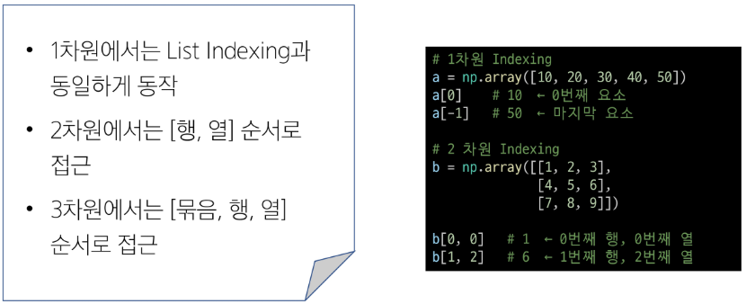

# 9월 18일

# 정규 표현식과 Numpy

### Regular Expression
- 방대한 택스트 속에서 원하는 데이터만 정교하게 걸러내고, 문자열 내 특정 패턴을 검색, 추출, 치환하는 기능

### Regex 실무 적용 분야
* 입력 값 검증 (validation)
* 텍스트 검색 (Search)
* 데이터 추출 (Extraction)
* 문자열 치환, 데이터 정제, 로그 분석 등에서 활용
  
* 핵심 흐름 : 원본 -> 패턴 -> 추출 -> Numpy

## 're' Module
- 정규 표현식 패턴을 컴파일 하고 실행하는 기능을 제공
**주요 패턴 매칭 함수**

- match()
    - 특징 : 문자열의 시작부터 패턴이 일치하는지 확인하고 매치
    - 용도 : 엄격함 형식 검증

- search()
    - 특징 : 문자열 전체를 훑어 처음 발견된 매치 객체 반환
    - 용도 : 텍스트 내 특정 정보 존재 여부 확인

- findall()
    - 특징 : 일치하는 모든 문자열을 리스트로 반환
    - 용도 : 데이터 수집 및 대량 추출

- finditer()
    - 특징 : 일치하는 모든 매치 객체를 반복자(iterator)로 반환
    - 용도 : 대용량 텍스트를 메모리 효율적으로 처리할 때

* Match Object란?
    - match()나 search()는 성공 시 'Match Object'를 돌려줌
    - Match Object 주요 메서드
        * group() : 매치된 전체 문자열 혹은 특정 그룹 추출
        * start() / .end() : 매치된 시작 인덱스와 끝 인덱스 확인
        * span() : (시작, 끝) 인덱스 튜플 반환

## Meta Character와 Raw String

### ***Meta Character***
* 정규식에서 특별한 의미를 갖는 문자 또는 기호

- .
    - 의미 : 문자 1개
    - 설명 : 줄바꿈을 제외한 어떤 문자 하나와 매치하는 패턴 (공백 포함)

- \d
    - 의미 : 숫자(digit)
    - 설명 : 0 ~ 9 사이의 숫자 문자 한 글자와 매치하는 패턴

- \w
    - 의미 : 단어(word) 
    - 설명 : 알파벳, 숫자, 언더바(_) 중 한 글자와 매치하는 패턴

- \s
    - 의미 : 공백(space)
    - 설명 : 공백 문자(스페이스, 탭, 줄바꿈 등) 한 글자와 매치하는 패턴

- \b
    - 의미 : 단어 경계 
    - 설명 : 단어와 비단어 사이의 경계 (공백 아님)

- \D
    - 의미 : 숫자 아닌 것
    - 설명 : 숫자 문자가 아닌 문자 한 글자와 매치하는 패턴

- \W
    - 의미 : \w 아닌 것 
    - 설명 : word 문자가 아닌 문자 한 글자와 매치하는 패턴

- \S
    - 의미 : 공백 문자가 아닌 것 
    - 설명 : 공백 문자 한 글자와 매치하는 패턴

### ***Raw String***
* Python 문자열 escape를 특별하게 해석하지 않고, 백슬래시 그대로 문자열에 포함시키는 문자열 리터럴
    - 단, Regex의 Excape는 사용 가능
    - r'\d' -> 숫자를 의미하는 메타 문자 표시
    - r'$' -> 문장 끝을 의미하는 메타 문자
    - r'\$' -> $문자를 의미 (메타 문자를 escape)
    - ㄱ'\\' -> 백슬래시를 의미 (python 문자열 escape와 형태 동일)
- 문자열에 r이 접두어로 붙으면 Raw String을 의미함

### ***Regex Pattern 예시***
- Pattern은 특정한 규칙을 가진 문자열의 추상적인 형태를 의미
    - 이메일 주소 : r'[\w.]+@[\w.]+' (예시임)

## Regex Basic Syntax
### ***반복자 (Quantifiers)***
* 앞에 온 문자가 몇 번 나타나는지 지정할 때 활용
* 데이터의 길이를 제한할 때 매우 중요하게 사용됨

- + 
    - 설명 : 1 회 이상 (최소 하나는 있어야 함)

- *
    - 설명 : 0 회 이상 (없어도 됨)

- ?
    - 설명 : 0회 또는 1회 (있을 수도 없을 수도)

- {n}
    - 설명 : 정확히 n회

- {n, n}
    - 설명 : n회부터 m회까지

### ***문자 집합***
* 대괄호 ('[]')로 표현하며, 집합에 포함된 문자 중 하나와 매치할 때 사용
* 쉼표나 공백 또한 하나의 문자로 인식함으로 Python List와 혼동하면 안 됨

- [abc]
    - a, b, c 중 문자 하나와 매치하는 패턴
- [a, b, c]
    - a, b, c (콤마 문자) 중 문자 하나와 매치하는 패턴
- [a-z]
    - a ~ z 까지 소문자 중 하나와 매치하는 패턴
- [0-9]
    - 0 ~ 9 까지 숫자 문자 중 하나와 매치하는 패턴
- [a-zA-Z0-9]
    - 영문 대소문자, 숫자 중 한글자와 매치하는 패턴
- [가-힣]
    -  한글 문자 하나와 매치하는 패턴

### ***Anchors***
* 문자열의 '어디'에 위치해야 하는지를 정의할 때 사용
* 데이터 파싱 시 줄의 시작이나 끝을 명확히 할 때 사용

- ^ 
    - 설명 : 문자열의 시작

- $
    - 설명 : 문자열의 끝

### ***Regex Group Syntax***
- 소괄호 ('()')를 사용하여 표현
- Regex Group 의 역할
    - 패턴 범위 지정
        - 여러 Meta Character를 하나의 단위로 묶는 역할
    - 데이터 추출
        - 괄호 안에서 매칭 된 내용을 기억하여 추출하는 역할
    - 그룹 재사용
        - 앞서 정의한 패턴과 동일한 패턴을 다시 정의하지 않고 이전에 정의한 패턴을 참조하여 효율적으로 패턴을 구성하는 역할

### ***데이터 추출***
- 괄호 안에서 매칭된 내용을 기억하여 추출하는 역할
    - index 기반 그룹 추출 방식
        - 그룹이 생성된 순서대로 번호가 부여됨
        - 번호는 1부터 시작
        - 번호 0은 전체 매칭 결과를 의미

- 이름 붙인 그룹 추출 방식
    - 그룹에 이름을 지정하여 이름으로 데이터 추출
    - 코드 가독성 좋음

### ***Regex 응용***
* Lookaround (전후방 탐색)
    - 특정 단어 뒤에 오는 숫자만 필요할 때, 혹은 특정 단어는 매칭 결과에 포함하고 싶지 않을 때 활용
* Lazy Matching (게으른 매칭)
    - 가장 긴 구간이 아닌 가장 짧은 구간만 매칭하고 싶을 때 활용
* Non-Capturing Group (비캡처 그룹)
    - 매칭 구조를 제어하면서도 결과 그룹으로 저장하지 않아 불필요한 캡처를 줄이고 패턴을 효율적으로 구성할 때 활용

### ***Lookaround (전후방 탐색)***

### ***Lazy Matching***

### ***Non-Capturing Group***

### ***Meta Charcter의 \b***

### ***Regex의 and 연산자***

## Numpy
* 파이썬에서 다차원 배열을 처리하기 위한 표준 라이브러리

- 대규모 다차원 배열과 행렬 지원
- 벡터, 행렬, 고차원 텐서에 대한 선형대수 연산 제공
- 서로 다른 크기의 배열도 규칙에 따라 연산 확장
- Python List 대비 연산 속도가 빠르고 메모리 사용량이 적어 대규모 데이터 처리에 적합함

### **Python List의 한계**
* Python List는 다양한 타입의 객체를 담을 수 있는 유연한 컨테이너
* List는 객체 참조 방식으로 동작
    - 각 요소는 메모리 어딘가에 저장된 '객체'를 가리키는 주소값
    - 값을 하나 꺼낼 때마다 주소를 찾아가서 객체를 열어봐야함 (Overhead 발생)
    - 객체들의 주소가 사방에 흩어져 있어, CPU가 데이터를 읽어오는 '캐시 히트' 효율이 낮음

* List는 연산자를 사용하면 수학적 계산이 아닌 리스트 조작으로 동작
    - 예) 모든 요소에 2를 곱하고 싶을 때

* 두 List 의 요소를 더해서 하나의 List로 만들고자 한다면 반복문이 필수

### **Numpy를 사용하는 이유**
* 연속된 메모리 구조를 사용하여 캐시 히트 효율이 높음
* 단일 데이터 타입 사용으로 메모리 낭비 최소화
* C 기반 내부 구현으로 반복문 오버헤드 줄임

### ** Demension**
* 배열이 몇 개의 방향으로 구성되어 있는가?

**Axis**
- axis = 0 : 첫 번쨰 차원
- axis = 1 : 두 번째 차원
- axis = n : n+1 번째 차원
- axis = -1 : 마지막 차원

### ***Numpy Slicing - 개념***
* List Slicing은 새로운 List를 복사해서 만들지만, NumPy의 기본 Slicing은 일반적으로 원본 일부를 가리키는 뷰를 생성
    - 기본 Slicing으로 만든 뷰를 수정하면 원본 배열도 함께 변경

* 1차원 Slicing 문법은 Python List Slicing과 동일
* 2차원 Slicing 문법은 indexing과 동일

## 벡터화와 브로드캐스팅
### **벡터화(Vectorization)란?**
* 반복문을 명시적으로 작성하지 않고 배열 연ㅅ낭르 수행하는 것을 의미
* 반복 작업을 C로 구현된 Numpy 내부 엔진에 전달하여 진행

### **NumPy 벡터화와 Python 루프**
* NumPy 벡터화
    - 동일한 타입의 데이터를 연속된 메모리에 저장
    - 타입 확인 없이 배열 전체를 한번에 연산

* Python 루프 - 매 반복마다 아래 과정 반복
    - 인터프리터 코드 해석
    - 요소의 타입 확인
    - 해당 타입에서 연산 가능 여부 확인
    - 연산 수행

## 브로드캐스팅
* 모양이 다른 두 배열 간의 산술 연산을 가능하게 하는 메커니즘
* NumPy가 오른쪽 끝 차원부터 비교하여, 부족한 차원을 논리적으로 확장
* (실제 메모리 복사 없이 확장된 것처럼 연산)

### ***브로드캐스팅 장점***
* 불필요한 메모리 복사 없이 연산 가능 -> 메모리 효율적
* 루프 없이 배열 전체에 연산 적용 -> 코드 간결
* NumPy 내부 최적화 연산 활용 -> 속도 향상

### ***브로드캐스팅 규칙***
* 두 배열의 차원수를 맞춘다
    - 차원 수가 다르면 부족한 쪽 앞에 1을 붙여줌
* 오른쪽 (마지막축) 부터 같은 위치끼리 하나씩 비교.
    - 크기가 같으면 -> 그대로 연산
    - 둘 중 하나가 1이면 -> 1인 쪽을 반복 연산 (메모리 복사 없음)
    - 둘 다 1이 아니고 크기도 다르면 -> 오류 발생
* 해당 규칙을 만족하지 못하면 브로드 캐스팅 불가능

### **브로드캐스팅 과정**
* 두 배열의 shape을 확인
* 크기가 다른 두 배열을 연산할 때 브로드캐스팅이 내부적으로 진행 됨

* 1단계 : 차원의 수를 맞춘다
* 2단계 : 오른쪽부터 하나씩 비교
* 3단계 : 결과

### ***NumPy 주요 함수 분류 5가지***
1. 수열 및 그리드 생성
2. 차원 조작 및 구조 설계
3. 조건부 선택 및 논리 ㅈ연산
4. 기본 통계 연산
5. 특수 연산

### ***공통 파라미터***
* axis
* keepdims
* dtype

### ***수열 및 그리드 생성 관련 함수***
* np.arange(start, stop, step)
    - 정수 수열 생성
* np.linspace(start, stop, num)
    - 특정 구간에 균등한 간격의 샘플 생성(시각화, 함수 샘플링)
    - endpoint=Ture이면 stop을 포함하며, num은 생성할 샘플 수
* np.eye(N)
    - 단위 행렬 생성 (선형 대수, 가중치 초기화)

### ***차원 조작 및 구조 설계***
* np.reshape(a, newshape)
* np.expand_dims(a, axis)
* np.squeeze(a, axis)
* np.transpose(a, axis) 또는 .T
* np.stack(arrays, axis)

### ***조건부 선택 및 논리 연산***
* np.where(condition, x, y)
    - 조건에 따라 두 배열에서 값을 선택(삼항 연산자)
* np.isin(a, values)
* np.any(a) / np.all(a)

### ***기본 통계 연산***
* np.sum(a, axis)
* np.mean(a, axis)
* np.medain(a, axis)
* np.std(a, axis)
* np.percentile(a, q, axis)
* NaN이 포함된 배열에서 일반 통계 함수 사용 시 결과가 NaN으로 반환

### ***특수 연산***

## Indexing Advanced
* Fancy indexing
* Boolean indexing
* 기본 indexing 및 Slicing과는 달리 뷰가 아닌 복사본이 생성됨

### **Fancy Indexing**

### **Boolean Indexing**
* True/False로 이루어진 배열(마스크, Mask)을 인덱스로 전달해 조건에 맞는 요소만 추출하는 방식
* 사용 방식
    - 배열[조건식]
* 동작 순서
    1. 조건식이 실행되어 True/False 배열(Mask)이 생성됨
    2. True인 위치의 값만 원본 배열에서 추출함

### **Fancy/Boolean Indexing 주의사항**
* 인덱스 범위 초과(Fancy Indexing)
    - 배열 크기를 벗어난 인덱스 전달 시 indexError 발생
* Mask 크기 불일치 (Boolean Indexing)
    - 마스크 크기가 원본 배ㅕㅇㄹ의 해당 축 크기와 정확히 일치해야 함.
* 복사본 생성으로 인한 메모리 사용
    - 선택 결과와 인덱스, 마스크 크기에 비례해 추가 메모리가 필요함
    - 연속 범위라면 추가 복사가 없는 기본 Slicing(View)을 우선 고려
* 다차원 팬시 인덱싱 결과의 Shape
    - 전달하는 인덱스 배열의 shape에 따라 결과 shape이 결정됨
    - arr[[0, 1], [0, 2]] -> (0,0)과 (1,2) 위치만 추출 -> shape (2,) 1차원 반환
    - 2차원 구조 유지가 필요하면 np.ix_() 사용

