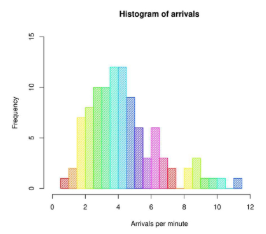
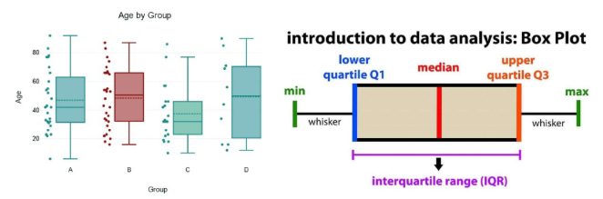
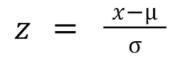
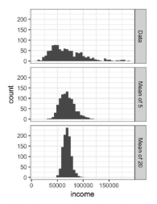

# 10월 6일 

# 통계 기초

## **기초 통계량**
- 데이터를 표현하는 변수들은 수천가지의 다른 값들을 가지고 있음. 그렇다면 데이터를 처음에 살표볼 떄 어떻게 접근하면 좋을까?
    - 데이터 분석의 첫 단계는 데이터의 크기, 분포, 중심, 퍼짐을 파악하는 것
    - 수 많은 값이 있는 데이터를 일일이 보는 것은 불가능에 가까움
    - 대표값(위치)과 변동성(퍼짐)을 요약하는 통계량을 활용
        - 각 변수를 대표하는 값을 구하여 데이터를 살펴봄
        - 데이터가 얼마나 퍼져 있는지 확인

### **기초 통계량(위치)**
- 각 변수를 대표하는 값을 구하여 데이터를 살펴봄
    - 위치를 추정하는 다양한 방법
        - 평균 (mean) : 모든 값을 더해 개수로 나눈 값으로 전체적인 중심을 나타내지만 이상치에 민감
        - 절사평균 (trimmed mean) : 상,하위 극단값 일부를 제거해 계산한 평균으로 이상치 영향을 줄이는 데 유용
        - 가중평균 (weighted mean) : 각 값의 중요도(가중치)를 반영해 계산해는 평균, 값의 영향력이 동일하지 않을 때 사용
        - 중간 값 (median) : 정렬된 데이터의 중앙 위치 값으로 왜곡된 분포에서도 안정적으로 중심을 나타냄
        - 가중 중간 값 (weighted median) : 값의 가중치를 고려해 중앙 위치를 결정하는 지표로 표본 비중이 다른 조사에서 활용
        - 백분위수 (percentile) : 데이터를 100등분 했을 때 틍정 위치의 값으로 분포의 형태와 위치를 파악하는데 사용

### **기초 통계량(변이)**
- 각 변수를 대표하는 값을 구하여 데이터를 살펴봄
- 데이터가 얼마나 퍼져 있는지를 확인
    - 변이를 추정하는 다양한 방법
        - 분산 (Variance) : 평균으로부터 얼마나 퍼져 있는지를 나타내는 지표
        - 표준편차 (Standard deviation) : 데이터의 편차(각 값에서 평균을 뺸 값)의 기준이 되는 값
        - 사분할 범위 (IQR) : 25번째 백분위수와 75번째 백분위수의 차이를 보는 것

## **표본 추출과 편향**
### **모집단과 표본의 개념**
- 모집단 : 연구 대상이 되는 전체 집단
- 표본 : 모집단에서 일부를 선택한 것

### **표본 조사의 필요성**
### ***인구조사 vs 표본 조사***

- 인구조사(census) -> 모집단 조사
    - 전체 국민을 조사하는 방법
    - 가장 정확하지만, 시간과 비용이 많이 소모

- 여론조사(Survey) -> 표본 조사
    - 모든 사람을 조사하는 것이 어렵기 떄문에 일부만 조사
    - 정확한 결과를 위해 표본을 신중히 선택
주의점)
    - 만약 표본이 특정 지역이나 연령대에 편향된다면, 전체 국민으 ㅣ의견을 제대로 반영지 못 함 (표본 편향 발생)

- 표본 추출 : 모집단에서 일부를 선택(추출) 하는 과정
주의점)
    - 잘 섞인 표본을 사용해야 함(표본 편향 발생)

### ***표본 추출의 방법***
| 표본 추출 방법 | 설명 | 예시 |
| ------------- | --- | --- |
| 단순 무작위 추출 | 모든 사람이 동일한 확률로 뽑힘 | 모자 속에서 랜덤하게 종이 한 장 뽑기 |
| 층화추출 | 모집단을 그룹(층)으로 나눈 후, 각 층에서 표본 추출 | 학년별 반 대표 한 명씩 뽑기 |
| 계통추출 | 모집단을 일정 간격으로 나누어, 표본을 추출 | 첫 번째 학생을 랜덤으로 선택한 후, 5명 마다 한 명씩 조사 |
| 군집 추출 | 모집단을 여러 그룹(군)으로 나눈 후, 몇 개의 군을 랜덤으로 선택 | 한 반을 통째로 뽑아 조사 |
| 편의 추출 | 쉽게 접근할 수 있는 표본을 선택 (비추천) | 길거리에서 가까운 사람들만 설문 조사 |

### ***임의 추출(무작위 추출)의 개념***
- 임의 추출(무작위 추출) : 모집단에서 특정한 규칙 없이 무작위로 표본을 선택하는 방법
- 표본 추출의 종류 : 1. 복원 추출, 2. 비복원 추출

### *** 임의 추출이 필요한 이유***
1. 공정성 유지 : 모든 대상이 동일한 확률로 선택될 기회 제공
2. 대표성 확보 : 특정 그룹에 치우치지 않고 모집단 전체를 반영
3. 평향 방지 : 의도적인 선택(예 : 특정 지역, 특정 연령대만 조사)을 막아 객관적인 데이터 확보
4. 통계 분석의 신뢰도 증가 : 모집단을 잘 반영한 표본이라면, 정확한 결론을 도출할 가능성이 높아짐

### *** 임의 추출(무작위 추출)과 표본 평균 비교 예제***
- 사용 데이터 : 펭귄 데이터셋
- 실험 내용
    - 전체 데이터에서 펭귄의 몸무게의 평균
    - 여러 개의 랜덤 표본 (크기=30)을 추출하여 각 표본 평균 계산
    - 모집단 평균과 표본 평균들의 차이를 히스토그램으로 표현

- 해석
    - 표본 평균의 분포는 정규 분포를 따름
    - 모집단 평균(빨간 점선)과 표본 평균의 중심(파란 히스토그램 중심)이 비슷함
    - 표본 크기가 클수록 표본 평균의 변동성이 줄어들며, 모집단 평균과 더욱 가까워짐

### ***표본 조사의 오류***
- 표본 오차
    - 표본을 뽑는 과정에서 우연히 생기는 차이
    - 같은 방법으로 뽑아도 표본마다 값이 조금씩 달라짐
    - 자연적인 흔들림이어서 개선이 되지만 없앨 수는 없음

- 비표본오차 (Non-Sampling Error)
    - 조사 절차(설계) 자체의 문제로 생기는 체계적 오류(=편향)
    - 표본의 틀 자체의 오류, 응답하지 않음, 응답 왜곡, 특정 집단만 포함되는 문제
    - 시작부터 실패한 구조적 편향이라 표본을 아무리 많이 뽑아도 해결되지 않음

### ***선택 편향 vs 표본 편향의 차이점***
표본 편향
- 정의 : 모집단을 대표하지 않는 표본을 선택하는 문제(표본 틀 자체가 대표성이 없음)
- 원인 : 지역, 연령,성별 등 특정 그룹 과대표/과소대표(편향된 모집단에서 샘플 추출)
- 예시 : 20대만 대상을 여론 조사
- 차이 : 결과물의 문제

선택 편향
- 정의 표본을 뽑는 과정자체가 특정한 사람들만 선택하도록 설계되어 결과가 왜곡되는 문제 (표본이 모이는 과정이 왜곡)
- 원인 : 자발적 참여, 특정 시간대 조사, 참여 조건 드응로 특정 그룹만 들어옴
- 예시 : 건강 관심자만 건강검진 연구에 참여함 (자발적 참여)
- 차이 : 뽑는 과정의 문제

### **선택 편향**
- 선택 편향 : 관측 데이터를 선택하는 방식 때문에 생기는 평향 (표본 편향의 일부)
- 즉, 특정한 선택으로 표본이 모집단을 대표하지 못 해 연구 결과가 왜곡되는 문제
- 중요한 이유
    - 선택 편향이 있으면, 연구결과를 모집단 전체에 적용하기 어려움
    - 특정 그룹의 과소/과대 평가될 위험이 있음
    - 특히, 의학 연구, 사회과학 연구, 정책 결정 등에서 큰 영향을 미침

### ***선택 편향이 발생하는 이유***
- 특정 그룹만 포함되는 경우
    - 연구 설계 과정에서 특정 특성을 갖은 사람들만 표본으로 포함
- 자발적 참여
    - 연구에 참여하는 사람이 스스로 결정 하면, 연구에 적극적으로 참여하는 사람만 포함될 가능성이 높음
- 예시) 건강 검짐
    - 건강검진 연구에서 건강에 관심 있는 사람만 참여한다면 편향 발생

### **예제**
- 사용 데이터 타이타닉 데이터셋
- 실험 내용
    - 전체 승객 데이터를 사용하여 생존율을 계산
    - 특정 조건(예시 : 1등석 승객만 선택)으로 필터링한 후 생존율을 다시 계산하는 상황
    - 두 결과를 비교하여 표본 편향이 생기는 원리 확인

- 해석
    - 전체 생존율은 약 38%
    - 1등석 생존율은 63%로 전체보다 매우 높음
    -> 1등석 승객만 표보능로 선택하면 생존율이 과대평가될 가능성이 있음
    - 2등석 생존율을 47%로 전체보다 조금 높음
    -> 2등석 승객만 선택하면 전체보다 약간 높게 측정됨
    - 3등석 생존율은 24%로 전체보다 낮음
    -> 3등석 승객만 포함하면 생존율이 과소평가되는 표본 평향이 발생할 수 있음

- 실험 상황
    - 연구자가 "타이타닉 선내 경험을 확인하기 위해 인터뷰 조사"를 진행했다고 가전
    - 인터뷰는 생존자에게만 가능
    - 연구 참여 가능성이 좌석 등급별로 다르게 주어짐
    - 사망자는 애초에 조사 대상이 될 수 없으므로, 생존자 중심 데이터만 수집됨

- 결과
    - 1등석은 생존자가 많음 -> 인터뷰 데이터에서도 1등석의 답변의 비율이 매우 높게 나타남
    - 이용객 수 대비 2, 3등석은 생존자가 적음 -> 인터뷰 데이터에 거의 포함되지 않음
    - 따라서 인터뷰 결과는 전체 승객의 경험이 아닌 1등석 중심 경험으로 왜곡됨 -> 선택 평향 발생

## **분포**
**분포 (Distribution)
- 분포 : 데이터가 어떤 값 주변에 어떻게 퍼져 있는지 (흩어져 있는지)를 나타내는 것입니다.
- 분포를 보면 데이터가 어떻게 생겼는지 (좁게 모여 있는지, 넓게 퍼져 있는지)를 알 수 있음

### **분포의 필요성**
- 데이터의 패턴 파악
    - 데이터가 대체로 어디에 몰려 있는지(중심경향) 확인
- 이상치 발견
    - 데이터를 분석할 때, 극단적으로 크거나 작은 값(이상치)을 찾는 것이 중요
- 비교와 예측 가능
    - 두 개 이상의 그룹을 비교할 때 어떤 차이가 있는지 시각적으로 확인 가능
- 적절한 분석 방법 선택
    - 데이터의 분포 형태에 따라 평균, 중앙값 등을 선택하여 분석 가능

### **분포 시각화 방법1**
- 히스토그램
    - 히스토그램은 데이터를 막대 그래프로 나타낸 것
    - 데이터의 전체적인 분포를 쉽게 확인 가능  

### **분포 시각화 방법2**
- 박스 플롯(Box Plot)
    - 박스플롯은 데이터의 범위, 중앙값, 이상치를 한 눈에 볼 수 있는 그래프
    - 데이터의 최소값, 최대값, 중앙값(50%), 1사분위(25%), 3사분위(75%)를 표현
    - 데이터의 퍼짐 정도(분산)와 이상치를 확인하는데 유용  

### **분포 시각화 방법3**
- 밀도 곡선(Density Plot)
    - 밀도곡선은 데이터를 연속적인 곡선 형태로 나타내어 데이터의 분포를 부드럽게 표현한 그래프
    - 히스토그램처럼 데이터를 나누지 않고 연속적인 곡선으로 표현
    - 데이터의 중심과 분포의 형태를 더 부드럽게 볼 수 있음

### **확률 분포(Probability Distribution)**
- 데이터가 나타날 수 있는 모든 값과 그 값들의 나올 확률을 정리한 것
- 확률분포가 가지는 의의
    - 데이터가 어느 값 주변에 얼마나 모여 있는가?
    - 특정 값이 나타날 가능성은 어느 정도인가?
- 확률분포는 크게 두 종류
    - 연속형 분포 : 정규분포, 균등분포 등
    - 이산형 분포 : 이항분포, 포아송분포 등
- 확률분포를 이해하면 데이터으 패턴과 특징을 설명할 수 있고 예측 모델과 통계적 추론에서 적합한 분석 방법을 선택할 수 있음

### **표본분포**
- 모집단에서 표본을 여러 번 뽑아서, 그때그때 계산한 "평균 비율" 같은 통계량이 만드는 분포
- 같은 모집단에서 동일한 크기 n의 표본을 많이 추출 했을 때, 어떤 통계량이 만들어내는 확률 분포
- 표본이 얼마나 흔들리는지 (불확실성)를 설명
- 특징)
    - 단일 표본 하나만 봤ㅇ르 때는 샘플 평균이 모집단의 평균에 가까울 수도 아닐 수도 있음
    - 많은 표본 평균을 모으면 특정한 패턴을 띠게 됨

### **정규분포 (Normal Distribution / Gaussian Distribution)**
- 정규분포는 종 모양 분포
- 특징
    - 평균과 표준편차로 정확히 모양이 결정됨
    - 가운데 값이 가장 많고 양옆으로 갈수록 빈도가 적어짐
    - 가운데 값이 가장 많고 양옆으로 갈수록 빈도가 적어짐
    - 현실에서 가장 흔히 나타나는 분포
    - 많은 자연 현상과 금융 데이터가 이 분포를 따르는 경우가 많음

- 정규 분포 : 데이터가 평균을 중심으로 대칭적인 종 모양을 띠는 분포
- 표준 정규 분포 : 평균이 0, 표준편차가 1인 정규분포

### **정규분포의 주요 특성**
- 대칭성
    - 평균을 중심으로 좌우 대칭
    - 평균 = 중앙값 = 최빈값
- 68-95-99.7 법칙
    - 데이터의 68%가 +-1 표준편차 내에 존재
    - 데이터의 95% 가 +-2 표준편차 내에 존재
    - 데이터의 99.7%가 +-3 표준편차 내에 존재

- 즉, 정규분포는 많은 자연적/사회적 현상에서 발견되며, 데이터 분석에서 필수적인 개념

### **QQ-plot**
- 데이터의 실제 분포가 정규분포와 얼마나 가까운지 그래프상으로 확인하는 대표적인 방법
- QQ-plot 보는 방법
    - x축은 이론적인 정규분포, y축은 실제 데이터 분포를 의미
    - 점들이 직선 위에 가까이 있으면 정규 분포에 가까운 것
* z-score

### **중심극한정리 (Central Limit Theorem, CLT)
- 모집단의 분포가 어떤 모양이든 상관없이, 충분히 큰 크기의 표본을 여러 번 추출해 계산한 표본평균의 분포는 정규분포에 가까워진다는 원리
- 모집단의 분포 모양은 다양함
    - 치우친 분포
    - 한쪽 꼬리가 긴 분포
    - 이산값 분포

- 표본의 크기 n이 충분히 크다면, 모집단의 분포 형태와 관계 없이 표본평균의 분포는 정규분포를 따르는 원리
- 특징
    - 모집단이 어떤 모양(정규분포가 아니어도)이라도 상관 없음
    - 표본 크기 n이 커질수록 표본평균의 분포가 정규분포에 가까워짐
    - 다양한 모집단에서도 정규 분포를 활용한 분석이 가능함

### **중심극한정리 중요성**
- 현실에서의 중요성
    - 금융, 경제, 데이터 분석을 하는 경우에는 모집단의 분포를 알 수 없음 
    -> 모집단의 평균을 추론할 수 있는 근거
    - 주식 수익률, 경제 지표 분석, 리스크 평가 등에서 정규 분포를 가정하여 확률을 계산할 수 있어 유용함

- 즉, 중심극한 정리를 활용하면 불규칙한 데이터도 정규분포를 가정하여 예측이 가능해짐

- 중심극한정리를 확인하는 예제
    - 원래 지수형태의 분포는 비대칭적
    - 하지만 여러 번 표본을 뽑아 평균을 구하면 정규분포에 가까움
    - 표본의 크기가 커지면 정규 분포 형태에 가까워짐

### **t분포**
- 정규분포는 모집단의 분포가 정규일 때 사용 가능하고, 표본평균의 분포도 CLT로 인해 정규에 가까움
- 현실에서는 모집단의 표준편차를 모름
- 그래서 (모집단의 표준편차) 대신 s(표본 표준편차)를 넣으면 -> 분포의 꼬리가 두꺼워짐 -> 이걸 반영한 분포가 t분포
- 왜 두꺼워지는가? -> 고정된 (시그마)가 아니라 표본마다 변화하는 s라서 더 멀리 떨어진 값이 나올 가능성이 생김
- t분포는 정규분포와 유사하지만 꼬리 부분이 더 두꺼운 확률분포

- 특징
    - 표본의 개수(표본의 크기)가 작거나 모집단의 표준 편차를 정확히 모를 떄 자주 사용
    - 꼬리가 더 두꺼움
    -> 정규분포보다 극단값이 나타날 가능성을 더 현실적으로 반영함
    - 자유도 개념  
    -> 자유도란, 간단히 말해 데이터를 가지고 얼마나 자유롭게 움직일 수 있는지를 나타내는 수  
    -> 자유도가 작을수록 꼬리가 두꺼워지고, 자유도가 커질수록 정규 분포와 비슷

- t분포 시각화 예제
    - t분포는 정규분포와 유사하지만, 자유도가 낮을 때 꼬리가 두꺼움
    - 자유도에 따라 모양이 달라짐
    - 자유도 up : 정규분포와 유사
    - 자유도 down : 꼬리가 두꺼워짐

- 가상 데이터를 통간 비교 시각화
    - 주황색 (t 분포)의 신뢰구간이 파란색 (정규분포)의 신뢰구간보다 더 넓음
    - 예를 들어 금융 데이터같은 경우 극단적인 수익률이 자주 나타나므로, t분포를 활용하여 분석이 더 적합하고 안전함
    - 이를 통해 t분포는 작은 표본을 이요할 떄 더 넓고 현실적인 신뢰구간 제공
    * 강의 한번도 확인 해봅시다.

## 가설 검정과 신뢰 구간
### **통계적 실험의 중요성**
- 데이터를 분석하지 않고 의사 결정을 내릴 경우 발생하는 문제  
    -> 많은 사람들이 직관이나 경험을 기반으로 결정. 이로 인해 잘못된 결론을 내릴 위험 큼

### **유의성 검정의 중요성**
- 유의성 검정(Significance Testing)은 "우리가 관측한 차이가 우연히 발생했을 확률"을 계산하는 과정
- 예제)
    - "신약이 효과가 좋다"는 주장을 하기 위해서 단순 평균 비교로는 차이가 크기 않아 보임
    - 이 차이가 우연이 아닐 확률을 계산해야 함.
    - 유의성 검정을 수행해서 p-value가 0.05 보다 작다면, "우연이 아닐 확률이 높음"
    -> 즉 신약이 효과가 있다고 판단

### **가설 설정 개념**
- 가설(Hypothesis)이란, 특정한 주장을 검증하기 위한 가정
    - 통계적 검정의 핵심은 "이 가설이 맞는지 아닌지 검증 하는 과정"
    - 관측한 데이터에서 "차이가 유의미한가?"를 검증하는 과정에서 가설을 설정해야 함

- 가설의 종류
    - 귀무가설(Null Hypothesis, H_0): 귀무가설은 "차이가 없다" 또는 "효과가 없다"는 기본 가설
    - 대립가설(Alternative Hypothesis, H_1): 대립 가설은 "차이가 있다" 또는 "효과가 없다"는 가설

### **신뢰 구간 (Confidence Interval, CI)
- 신뢰구간은 모집단의 참된 평균(모수)를 포함할 것으로 예상되는 값의 범위
    - 표본에서 얻은 평균을 기반으로 모집단의 평균이 어느 범위 안에 있을지를 추정하는 방법
- 예제 (95% 신뢰구간)
    - "새로운 마케팅 전략이 고객 구매율을 평균 2~5% 증가시킬 것이다."
    - 즉, 95% 확신을 가지고" 구매율 증가 범위는 2~5% 사이" 라고 말할 수 있음

- 신뢰 구간과 가설 검정 관계
    - 만약 신뢰구간이 0을 포함하지 않으면, 차이가 유의미하다고 판단!

### **귀무가설과 대립가설의 개념**
- 귀무가설(Null Hypothesis) : "차이가 없다" 또는 "효과가 없다"는 기본 가설
- 대립가설(Alternative Hypothesis) : 대립 가설은 "차이가 있다" 또는 "효과가 있다"는 가설

### **유의수준(a)의 개념**
- 유의 수준 : 우리가 허용할 "우연한 결과"의 최대 확률을 의미
    - 보통 0.05(5%) 또는 0.01(1%)를 사용
    - 즉, "5%의 확률로 우연한 결과를 허용하겠다"라는 의미
- 유의수준(a=0.05)의 해석
    - 검정 결과가 귀무가설이 맞더라도, 5% 확률로 틀린 결론을 내릴 수 있음
    - 즉, 1종 오류를 5% 이내로 제한하겠다는 의미  
    -> 유의수준을 낮출수록 (a=0.01), 더 엄격한 검정을 수행하지만, 2종 오류위험 증가

### **t-검정**
- t-검정은 두 집단의 평균 차이가 통계적으로 유의미한 지를 검정하는 방법
- 특징
    - 모집단의 균을 비교하는 검정 방법
    데이터가 정규성을 만족해야 함
    - 표본 수가 적더라도 비교적 정확한 결과를 제공

- t-검정의 가설 설정 예시
    - 귀무가설 : 두 집단의 평균이 같다 (차이가 없다)
    - 대립가설 : 두 집단의 평균이 다르다 (차이가 있다)

### **t-통계량**
- 두 집단의 평균 차이가 우연인지, 실제로 의미 있는 차이인지를 판단하기 위한 지표
- 특징
    - 이 t값을 이용해 p-value를 계산
    - t가 클 수록 두 집단이 다를 가능성이 커짐
- t-통계량 수식
    - t=(두 집단의 평균 차이) / (데이터의 퍼짐 정도) = (신호)/(잡음)으로 표현
    - 평균 차이가 크면 t는 커진다.
    - 데이터가 들쭉날쭉(표준편차가 크면) t는 작아진다.
    - 표본이 많을 수록 t는 커진다.

### **p-value의 개념**
- p-value : 귀무가설이 참이라고 가정했을 때, 현재 관측된 결과보다 극단적인 결과가 나올 확률
    - "이 차이가 단순한 우연일 가능성이 얼마나 되는지"를 나타냄
    - p-value가 작을수록 우리가 관측한 차이가 우연일 가능성이 낮아짐
- 해석 기준(유의 수준 a= 0.05일 떄)
    - p-value <= 0.05 -> 귀무가설 기각 -> "차이가 유의미하다!"
    - p-value 0.05 -> 귀무가설 유지 -> "차이가 우연일 가능성이 크다"  
    -> 즉, p-value가 작으면 "이건 우연이 아니다. 실제 차이가 있는 것이다"라고 결론을 내림

### **가설 검정의 개념**
- 가설 검정은 데이터를 기반으로 특정 가설이 맞는지 판단하는 과정
- 즉, 표본 데이터를 이용해 모집단의 특성을 추론하는 방법

### **가설 검정의 흐름**
- 데이터를 기반으로 통계적 결론을 도출하는 과정은 다음과 같다.

데이터 수집 -> 데이터 전처리 -> 정규성 검정 -> 가설 검정 -> 결과 해석

### **정규성 검정(Normality Test)의 개념**
- 정규성 검정은 데이터가 정규분포를 따르는지 확인하는 과정
    - 통계적 검정(t검정, ANOVA)을 수행하기 전에 정규성 가정을 만족하는지 확인하기 위한 작업
- 정규성을 검정하는 대표적인 방법
    - Shapiro-Wilk Test -> 소규모 표본(50)개 이하에 적합
    - Kolmogorov-Smirnov Test -> 정규성과 다른 분포 간 차이를 검정

### **Shapiro-Wilk Test의 개념**
- Shapiro-Wilk 검정은 정규성을 검정하는 가장 대표적인 방법
    - 귀무가설 : 데이터는 정규분포를 따름
    - 대립가설 : 데이터는 정규분포를 따르지 않음
- p-value 해석
    - p-value <= 0.05 -> 귀무가설 기각 -> 정규성이 없음
    - p-value 0.05 -> 귀무가설 유지 -> 정규성을 만족함
    - 즉, p-value가 0.05보다 크면 "데이터가 정규성을 만족한다고 판단할 수 있음"

### **등분산 검정의 개념**
- 등분산 검정은 두 개 이상의 그룹이 동일한 분산을 갖고 있는지 검정
    - t검정, ANOVA와 같은 통계 검정을 수행하기 전에 반드시 확인하기 위한 작업
    - 등분산이 만족되지 않으면 Welch's t-test 또는 비모수 검정을 사용해야 함
- 대표적인 등분산 검정 방법
    - Leven's Test(레빈 검정) -> 가장 일반적으로 사용됨

### **Levene's Test의 개념**

### **가설 검정 프로세스**
1. 가설 설정
2. 유의 수준 결정
3. 검정 통계량 계산
4. p-value 확인
5. 결론 도출

### **유의성 검정의 유형**

### **t검정의 개념**

### **독립 표본 t검정 개념**
- t검정 종류의 일종으로 서로 독립적인 두 집단의 평균 비교
- 사용 목적
    - 서로 다른 집단의 평균 차이를 비교하고 싶을 때
    - 두 집단이 서로 독립적이며, 관측 값이 중복되지 않을 때
    - 데이터가 정규성을 만족할 때

### **대응 표본 t검정 개념**
- t검정 종류의 일종으로 같은 집단에서 두 시점 또는 두 조건에서의 편균 차이를 비교
- 특징
    - 같은 개체(그룹)에서 두 번 측정된 데이터를 비교할 때 사용
    - 이전 상태오 ㅏ이후 상태 사이의 편균 차이가 유의미한지 검정
    - 집단 간 비교가 아니라, 같은 개체에서 변화가 있는지 분석

### **Welch's t-test 개념**
- 독립 t-검정 변형의 일종, ***두 집단의 분산이 다를 때(이분산) 사용***